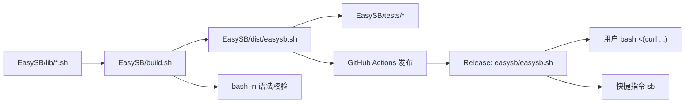

# EasySB 脚本重构设计

Feature Name: easysb-refactor
Updated: 2026-09-20

## Description

把上游 `fscarmen/sing-box` 单文件脚本（约 6900 行）重构为 `EasySB/` 项目：
功能与交互选项完全保留，源码按功能拆分为模块，由构建脚本合成单文件发行版，
并补齐测试与发布流水线。

## Architecture

核心约束是运行期只能是一个文件：用户安装方式是 `bash <(curl ...)`，
因此模块化只发生在源码层面，构建期把模块拼成单文件。



请求路径与上游一致：脚本下载内核、探测 CDN、生成配置、启动服务、导出订阅。
区别只在资源地址与源码组织。

## Components and Interfaces

### 模块清单

合成顺序即文件编号顺序，`18-entry.sh` 必须位于最后，否则入口不会执行。

| 模块 | 职责 |
| :--- | :--- |
| `00-header.sh` | 项目常量、脚本版本、全局默认值、临时目录与 trap |
| `01-i18n.sh` | 中英文文案表 `E[]` / `C[]`，共 191 条 |
| `02-utils.sh` | 彩色输出、`reading`、`text`、`status_on_off_regex`、步骤计算 |
| `03-detect.sh` | CDN 代理探测、ChatGPT 解锁检测、运行次数统计、语言选择 |
| `04-input.sh` | CDN / UUID / 节点名输入校验 |
| `05-config.sh` | 配置生成与在线修改（含 Hysteria2 带宽、端口跳跃、独立端口） |
| `06-argo.sh` | Argo 隧道（Token / JSON / API / 临时隧道） |
| `07-route.sh` | 自定义路由规则管理 |
| `08-warp.sh` | WARP 账户注册与 Hysteria2 Realm |
| `09-system.sh` | 系统检测、服务控制、安装状态与运行信息 |
| `10-ports.sh` | 端口编排、端口跳跃 NAT 与防火墙联动 |
| `11-firewall.sh` | 依赖安装与 UFW / firewalld / iptables 规则 |
| `12-baseconf.sh` | 服务端基础配置生成与协议 inbound 渲染 |
| `13-install.sh` | 安装主流程编排 |
| `14-export.sh` | 节点导出、分享链接、二维码、订阅站点 |
| `15-protocols.sh` | 协议增删 |
| `16-maintenance.sh` | 内核版本维护与卸载 |
| `17-menu.sh` | 主菜单与安装后菜单 |
| `18-entry.sh` | 脚本入口：CDN 探测、参数解析、安装或菜单 |

### 接口

构建接口：

```bash
bash EasySB/build.sh           # 生成 dist/easysb.sh
bash EasySB/build.sh --check   # 只校验，不写文件
```

测试接口：

```bash
bash EasySB/tests/run-tests.sh
```

## Data Models

脚本运行期状态沿用上游结构，关键全局量：

| 变量 | 含义 |
| :--- | :--- |
| `WORK_DIR` | 运行目录，固定 `/etc/sing-box` |
| `TEMP_DIR` | 临时目录，固定 `/tmp/sing-box` |
| `PROTOCOL_LIST` / `NODE_TAG` | 12 个协议显示名与标签 |
| `PROJECT_RAW` / `PROJECT_RELEASE` / `PROJECT_SCRIPT_URL` | 本仓库资源地址 |
| `E[]` / `C[]` | 英文 / 中文文案表 |
| `STATUS[]` / `OPTION[]` / `ACTION[]` | 服务状态、菜单项与动作分派 |

## Correctness Properties

1. 合成后的脚本必须通过 `bash -n`。
2. 合成前后代码行数差异只允许来自模块间空行。
3. `E[]` 与 `C[]` 下标集合相等，且每条文案两语言均非空。
4. 顶层函数名不得重复（heredoc 内的同名片段不计）。
5. 发行脚本中不得出现上游脚本仓库的下载地址、Issues 地址与统计接口。
6. 入口模块必须是合成顺序的最后一项。

## Error Handling

| 场景 | 处理策略 |
| :--- | :--- |
| 缺少模块文件 | `build.sh` 报错退出，不产出半成品 |
| 首模块缺少 shebang | `build.sh` 报错退出 |
| 合成后语法错误 | `build.sh` 报错退出，不覆盖已有产物 |
| 测试用例失败 | `run-tests.sh` 汇总失败套件并返回非零 |
| 未安装 shellcheck | lint 测试跳过，其余测试照常执行 |
| 内核下载失败 | 沿用上游逻辑：多次重试并切换代理与直连 |

## Test Strategy

| 套件 | 覆盖内容 |
| :--- | :--- |
| `test-build.sh` | 模块清单完整性、入口顺序、shebang、产物语法与可执行位 |
| `test-unit.sh` | 加载无副作用模块，验证 `text`、`status_on_off_regex`、`calc_install_steps` |
| `test-i18n.sh` | 中英文条目数一致、无缺失与空值、规模下限 |
| `test-static.sh` | 项目地址、协议与菜单完整性、无上游残留、无重复顶层函数 |
| `test-lint.sh` | shellcheck 错误码不在白名单内即失败 |

本地与 CI 使用同一入口 `bash EasySB/tests/run-tests.sh`，避免两套校验口径。

## References

[^1]: (网站) - [EasySB 项目地址](https://github.com/MinimaxFlora/EasySB)
[^2]: (网站) - [参考项目 fscarmen/sing-box](https://github.com/fscarmen/sing-box)
[^3]: (文件) - [requirements.md](./requirements.md)
