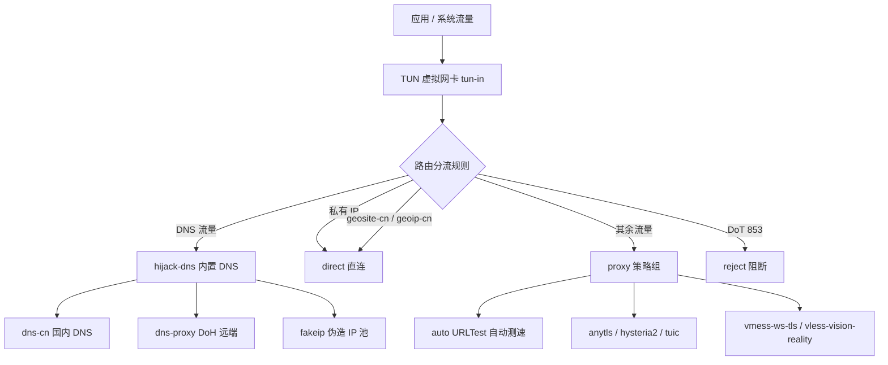

<div align="center">

# Sing-Box Templates

**一套开箱即用的 sing-box 配置模板集合 · 覆盖主流抗封锁协议 · 开箱可读 · 逐行注释**

[](https://sing-box.sagernet.org/)

[](#-协议矩阵)
[](#-配置规范)
[](#-参与贡献)

<sub>VLESS · Vision · REALITY · VMess · WebSocket · Hysteria2 · TUIC · AnyTLS · TUN · FakeIP</sub>

</div>

---

## 目录

- [项目简介](#-项目简介)
- [核心特性](#-核心特性)
- [协议矩阵](#-协议矩阵)
- [目录结构](#-目录结构)
- [快速开始](#-快速开始)
- [配置详解](#-配置详解)
  - [VLESS + Vision + REALITY](#1-vless--vision--reality)
  - [VMess + WebSocket + TLS](#2-vmess--websocket--tls)
  - [Hysteria2](#3-hysteria2)
  - [TUIC](#4-tuic)
  - [AnyTLS](#5-anytls)
  - [TUN + FakeIP 全局模板](#6-tun--fakeip-全局模板)
- [选型指南](#-选型指南)
- [设计约定](#-设计约定)
- [安全须知](#-安全须知)
- [参与贡献](#-参与贡献)

---

## 项目简介

本仓库汇集了 **sing-box** 的实战配置模板，每一个协议目录都同时提供 `config_server.json`（服务端）与 `config_client.json`（客户端）两份配置，节点信息完全对齐、即改即用。

所有配置均采用 **JSONC（带注释的 JSON）** 编写，关键字段逐行标注用途、取值与注意事项，既可直接部署，也可作为学习 sing-box 配置体系的参考读物。

> 目标：让一份配置同时承担 **生产可用** 与 **教学可读** 两种角色。

---

## 核心特性

| 特性 | 说明 |
| :--- | :--- |
| **成对交付** | 服务端 / 客户端配置一一对应，字段严格匹配，杜绝"对不上"的经典问题 |
| **逐行注释** | 每个关键字段都附带中文说明，解释"它是什么"以及"为什么这样填" |
| **协议齐全** | TCP / QUIC 两大体系，涵盖免证书伪装、证书 TLS、抗 DPI 填充三条技术路线 |
| **现代规范** | VMess 采用 AEAD（`alterId: 0`），VLESS 启用 Vision 流控，并默认配置 uTLS 指纹伪装 |
| **性能优先** | QUIC 协议默认 `bbr` 拥塞控制、`native` UDP 转发、Hysteria2 端口跳跃 |
| **全局方案** | `Templates/` 提供 TUN + FakeIP + 规则分流的完整落地模板，含策略组自动测速 |
| **零外部依赖** | 纯配置仓库，不绑定任何面板或脚本，克隆即可使用 |

---

## 协议矩阵

| 目录 | 协议 | 承载层 | 伪装 / 加密 | 关键能力 |
| :--- | :--- | :--- | :--- | :--- |
| `VLESS-Vision-Reality/` | VLESS + Vision | TCP | REALITY（免证书） | `xtls-rprx-vision` 流控、借用真实站点证书、抗主动探测 |
| `VMess-WebSocket-TLS/` | VMess | WebSocket over TLS | 证书 TLS | Mux 多路复用、0-RTT Early Data、可穿 CDN |
| `Hysteria2/` | Hysteria 2 | QUIC / UDP | TLS（ALPN `h3`） | 端口跳跃、BBR、弱网高丢包场景表现优秀 |
| `Tuic/` | TUIC | QUIC / UDP | TLS（ALPN `h3`） | 0-RTT 握手、`native` UDP 转发、低延迟 |
| `AnyTLS/` | AnyTLS | TCP | 证书 TLS | Padding Scheme 多阶段填充，对抗流量特征分析 |
| `Templates/` | TUN + FakeIP | 系统全局 | — | 规则分流、DNS 拆分、URLTest 自动测速 |

---

## 目录结构

```text
sing-box-templates/
├── VLESS-Vision-Reality/
│   ├── config_server.json      # VLESS + xtls-rprx-vision + REALITY 服务端
│   └── config_client.json      # 对应客户端配置
├── VMess-WebSocket-TLS/
│   ├── config_server.json      # VMess + WebSocket + TLS + Mux 服务端
│   └── config_client.json      # 对应客户端配置
├── Hysteria2/
│   ├── config_server.json      # Hysteria2 服务端（QUIC）
│   └── config_client.json      # 客户端（含端口跳跃与 NAT 重定向说明）
├── Tuic/
│   ├── config_server.json      # TUIC 服务端（QUIC）
│   └── config_client.json      # 对应客户端配置
├── AnyTLS/
│   ├── config_server.json      # AnyTLS 服务端（含流量填充策略）
│   └── config_client.json      # 对应客户端配置
└── Templates/
    └── tun-fakeip.json         # TUN 全局代理 + FakeIP + 规则分流模板
```

---

## 快速开始

### 1. 获取模板

```bash
# 克隆仓库
git clone https://github.com/MinimaxFlora/sing-box-templates.git

# 进入目标协议目录
cd sing-box-templates/VLESS-Vision-Reality
```

### 2. 替换占位信息

所有模板中的以下字段均为**示例值**，部署前必须替换：

| 字段 | 出现位置 | 说明 |
| :--- | :--- | :--- |
| `server` | 客户端 | 你的服务器 IP 或域名 |
| `server_port` / `listen_port` | 客户端 / 服务端 | 实际监听端口 |
| `uuid` | VLESS / VMess / TUIC | 用户唯一标识，客户端与服务端必须一致 |
| `password` | Hysteria2 / TUIC / AnyTLS | 认证密码，两端必须一致 |
| `private_key` / `public_key` | REALITY 服务端 / 客户端 | REALITY 密钥对，需成对生成 |
| `short_id` | REALITY 服务端 / 客户端 | Short ID，两端必须一致 |
| `certificate_path` / `key_path` | 证书类服务端 | TLS 证书与私钥的绝对路径 |
| `server_name` | 客户端 / 服务端 | SNI 域名，需与证书或伪装目标匹配 |

### 3. 校验并运行

```bash
# 校验配置语法
sing-box check -c config_server.json

# 前台运行（调试用）
sing-box run -c config_server.json

# 以 systemd 方式常驻
sing-box run -c /etc/sing-box/config.json
```

---

## 配置详解

### 1. VLESS + Vision + REALITY

> 目录：`VLESS-Vision-Reality/`

**技术要点**

- **REALITY 免证书伪装**：服务端无需自备域名与证书，直接借用真实站点（默认 `apple.com`）的 TLS 握手特征。未授权连接会被回源转发至该站点，主动探测者只能看到真实的 HTTPS 服务。
- **Vision 流控**：`flow: "xtls-rprx-vision"` 消除双重 TLS 握手特征与数据包长度特征，是 VLESS 在 TCP 上的当前最优解。
- **uTLS 指纹伪装**：客户端以 Chrome 指纹完成握手，避免因 TLS 指纹异常被识别。

**密钥生成**

```bash
# 生成 REALITY 密钥对（输出 PrivateKey 与 PublicKey）
sing-box generate reality-keypair

# 生成随机 Short ID
sing-box generate rand --hex 8

# 生成随机 UUID
sing-box generate uuid
```

**关键字段对齐**

| 服务端 | 客户端 |
| :--- | :--- |
| `users[].uuid` | `uuid` |
| `users[].flow` | `flow` |
| `tls.reality.private_key` | `tls.reality.public_key` |
| `tls.reality.short_id[]` | `tls.reality.short_id` |
| `tls.reality.handshake.server` | `tls.server_name` |

---

### 2. VMess + WebSocket + TLS

> 目录：`VMess-WebSocket-TLS/`

**技术要点**

- **WebSocket 承载**：`transport.type = "ws"`，路径默认 `/vmess`，可无缝置于 Nginx / Caddy 之后，适合套 CDN。
- **AEAD 规范**：`alterId: 0`，摒弃已被淘汰的 MD5 认证方式。
- **0-RTT Early Data**：`max_early_data: 2048` 配合 `Sec-WebSocket-Protocol` 头，降低建连延迟。
- **Mux 多路复用**：复用物理连接承载多个逻辑流，减少并发握手开销。

**Nginx 反代要点**

```nginx
location /vmess {
    if ($http_upgrade != "websocket") { return 404; }
    proxy_redirect off;
    proxy_pass http://127.0.0.1:10001;
    proxy_http_version 1.1;
    proxy_set_header Upgrade $http_upgrade;
    proxy_set_header Connection "upgrade";
    proxy_set_header Host $host;
}
```

---

### 3. Hysteria2

> 目录：`Hysteria2/`

**技术要点**

- **QUIC / UDP 传输**：基于 QUIC 的拥塞控制，在弱网、高丢包、跨境长肥管道场景下吞吐显著优于 TCP 方案。
- **端口跳跃**：客户端配置 `server_ports: ["2080:3000"]`，服务端通过 NAT 将整个 UDP 端口段重定向至实际监听端口，规避单端口 QoS 限速。
- **带宽声明**：`up_mbps` / `down_mbps` 用于拥塞控制估算，填写真实带宽可获得更准确的速率控制。

**服务端端口段重定向**

```bash
# 使用 nftables 建立 nat 表与 prerouting 链
nft add table ip nat
nft 'add chain ip nat prerouting { type nat hook prerouting priority dstnat; }'

# 将 UDP 2080-3000 端口段重定向至 443
nft add rule ip nat prerouting udp dport 2080-3000 redirect to :443

# 使用 iptables 的等价写法
iptables -t nat -A PREROUTING -p udp --dport 2080:3000 -j REDIRECT --to-ports 443
```

---

### 4. TUIC

> 目录：`Tuic/`

**技术要点**

- **0-RTT 握手**：默认关闭（`zero_rtt_handshake: false`）以规避重放攻击；链路质量优先时可开启。
- **原生 UDP 转发**：`udp_relay_mode: "native"` 直接转发 UDP 数据报，是游戏与实时音视频的最优选择。
- **BBR 拥塞控制**：`congestion_control: "bbr"`，在高延迟链路上显著提升吞吐。
- **心跳保活**：`heartbeat: "10s"` 维持长连接并感知链路中断。

---

### 5. AnyTLS

> 目录：`AnyTLS/`

**技术要点**

- **Padding Scheme 抗 DPI**：通过 `padding_scheme` 为不同序号的数据包指定固定或随机填充长度，打散流量特征，有效对抗深度包检测与流量指纹分析。
- **标准 TLS 语义**：保留标准 TLS 握手与 ALPN 协商（`h3` / `h2` / `http/1.1`），可搭配真实证书使用。
- **连接池预热**：客户端 `min_idle_session: 5` 维持空闲预连接，降低首包延迟。

---

### 6. TUN + FakeIP 全局模板

> 文件：`Templates/tun-fakeip.json`

这是一份可直接作为**客户端主配置**的模板，串联了本仓库的全部协议节点，并给出完整的全局代理方案。

**架构总览**



**DNS 分层策略**

| DNS 服务器 | 类型 | 适用场景 |
| :--- | :--- | :--- |
| `fakeip` | FakeIP | 常规 A/AAAA 查询，返回伪造 IP 以加速建连 |
| `dns-cn` | UDP `223.5.5.5` | `geosite-cn` 国内域名解析，就近返回结果 |
| `dns-proxy` | DoH `dns.google` | 兜底解析，经代理线路请求，避免污染 |

**路由分流规则（按序匹配，命中即止）**

1. TUN 入站 DNS 流量 → `hijack-dns` 劫持至内置 DNS
2. `clash_mode = Global` → 全部走 `proxy` 策略组
3. 私有 IP → `direct` 直连
4. `geosite-cn` 域名集合 → `direct` 直连
5. `geoip-cn` IP 集合 → `direct` 直连
6. `clash_mode = Direct` → 全部直连
7. 目标端口 853（DoT） → `reject` 阻断，防止应用绕过本地 DNS
8. 兜底 `final` → `proxy` 策略组

**策略组设计**

| 策略组 | 类型 | 作用 |
| :--- | :--- | :--- |
| `proxy` | `selector` | 手动选择出口，默认指向 `auto` |
| `auto` | `urltest` | 定期对全部节点测速，自动切换最优线路 |

`urltest` 配置了 `tolerance: 30`（新节点需快 30ms 以上才切换，避免频繁抖动）与 `idle_timeout: "30m"`（无流量时暂停后台测速）。

**启用控制面板**

模板已开启 Clash API 兼容接口，可直接接入 Yacd / Metacubexd 等 WebUI：

```text
external_controller: 127.0.0.1:9090
external_ui:         ui
default_mode:        Rule
```

---

## 选型指南

| 场景 | 推荐协议 | 理由 |
| :--- | :--- | :--- |
| 追求抗封锁与隐蔽性 | VLESS + Vision + REALITY | 免证书、借用真实站点、抗主动探测 |
| 需要套 CDN / 反代 | VMess + WebSocket + TLS | WebSocket 可被标准 HTTP 基础设施代理 |
| 弱网、高丢包、跨境长途 | Hysteria2 | QUIC + BBR + 端口跳跃，弱网表现最佳 |
| 游戏、实时音视频 | TUIC | `native` UDP 转发，延迟最低 |
| 对抗流量指纹分析 | AnyTLS | 多阶段 Padding Scheme 打散特征 |
| 需要系统级全局代理 | TUN + FakeIP 模板 | 接管全部流量，内置规则分流与自动测速 |

---

## 设计约定

- **JSONC 格式**：配置中允许 `//` 行注释，便于阅读；正式使用时 sing-box 可直接加载，若使用严格 JSON 校验工具请先行去注释。
- **端口约定**：服务端默认 `443`，本地混合入站（HTTP + SOCKS5）默认 `10000`。
- **地址约定**：入站统一监听 `::`，同时覆盖 IPv4 与 IPv6。
- **标签约定**：出站 `tag` 与协议名保持一致（如 `hysteria2`、`tuic`），便于在 `route` 与策略组中引用。
- **加密约定**：VMess / VLESS / TUIC 统一使用 `alterId: 0` 与现代 AEAD 语义。

---

## 安全须知

> **重要**：仓库中的 UUID、密码、REALITY 私钥、证书路径等**全部为示例值**，直接用于生产环境等同于无防护。

- 部署前**务必**重新生成全部密钥与 UUID，且服务端与客户端保持严格一致。
- REALITY 私钥仅存于服务端，切勿提交至任何公开仓库。
- 证书类协议请使用真实域名与有效证书，并将证书文件权限收紧至 `600`。
- 请遵守所在地区的法律法规，仅在合法授权的网络环境中使用本项目。

---

## 参与贡献

欢迎提交新的协议模板或改进现有配置：

1. Fork 本仓库
2. 新建分支：`git checkout -b feat/add-<protocol>-template`
3. 保持服务端 / 客户端成对提交，并补齐字段注释
4. 提交前执行 `sing-box check -c <file>` 校验语法
5. 发起 Pull Request，并说明协议特性与测试环境

---

<div align="center">

**Built for sing-box · Keep it readable, keep it reliable.**

MIT License © [MinimaxFlora](https://github.com/MinimaxFlora)

</div>
