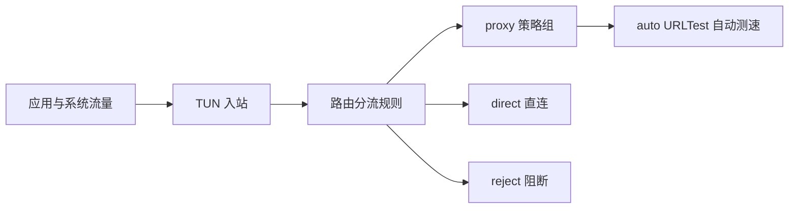

<div align="center">

# EasySB

**sing-box 配置模板集 + 一键部署脚本 · 模板开箱可读 · 脚本一键落地**

[](https://sing-box.sagernet.org/)

[](#easysb-支持协议)
[](#快速开始)

**简体中文** | [English](README_EN.md)

<sub>VLESS · Vision · REALITY · VMess · WebSocket · Hysteria2 · TUIC · AnyTLS · ShadowTLS · Shadowsocks · Trojan · NaiveProxy · TUN · FakeIP</sub>

</div>

---

## 目录

- [项目简介](#项目简介)
- [仓库结构](#仓库结构)
- [快速开始](#快速开始)
- [EasySB 能力](#easysb-能力)
- [EasySB 支持协议](#easysb-支持协议)
- [EasySB 命令参数](#easysb-命令参数)
- [配置模板矩阵](#配置模板矩阵)
- [订阅模板](#订阅模板)
- [选型指南](#选型指南)
- [内核与发行流程](#内核与发行流程)
- [安全须知](#安全须知)
- [参与贡献](#参与贡献)
- [开源协议](#开源协议)

---

## 项目简介

本仓库同时提供两种使用形态，可以只用模板，也可以全部交给脚本：

1. **配置模板**：`VLESS-Vision-Reality/`、`VMess-WebSocket-TLS/`、`Hysteria2/`、`Tuic/`、`AnyTLS/` 五个协议目录，各自提供成对的 `config_server.json` 与 `config_client.json`，另有 `Templates/tun-fakeip.json` 作为系统级全局代理模板。所有配置采用 JSONC（带注释的 JSON）编写，关键字段逐行标注用途与取值。
2. **一键部署脚本 EasySB**：`EasySB/` 目录是脚本源码，把 12 种协议一次性部署到 Linux VPS，覆盖证书申请、端口编排、伪装站点、节点导出、订阅生成与自更新。

EasySB 重构自 [fscarmen/sing-box](https://github.com/fscarmen/sing-box)，功能、菜单与交互选项与上游保持完全一致，差异仅在于远端资源地址统一指向本仓库，并把源码拆分为可读模块。

- 项目地址：https://github.com/MinimaxFlora/EasySB
- 参考项目：https://github.com/fscarmen/sing-box
- 变更记录：[CHANGELOG.md](CHANGELOG.md)
- 贡献指南：[CONTRIBUTING.md](CONTRIBUTING.md)
- 安全策略：[SECURITY.md](SECURITY.md)

---

## 仓库结构

```text
.
├── EasySB/                       # 一键部署脚本
│   ├── lib/                      # 源码模块，编号顺序即合成顺序（19 个）
│   ├── tests/                    # 测试套件（构建 / 文案 / 静态 / lint）
│   ├── docs/FEATURE-MAP.md       # 需求与实现对照表
│   ├── build.sh                  # 模块合成单文件 + 语法校验
│   ├── config.conf               # 无交互安装配置模板
│   ├── force_version             # 内核强制版本文件
│   └── dist/                     # 构建产物，git 忽略，仅发布到 Releases
├── Templates/                    # 客户端订阅与全局代理模板
│   ├── config.yaml               # Clash / Mihomo 订阅
│   ├── config-rule.yaml          # Clash / Mihomo 订阅
│   ├── config.json               # sing-box SFM / SFA / SFI 订阅
│   └── tun-fakeip.json           # TUN 全局代理 + FakeIP 模板
├── VLESS-Vision-Reality/         # 协议配置模板
├── VMess-WebSocket-TLS/          # 协议配置模板
├── Hysteria2/                    # 协议配置模板
├── Tuic/                         # 协议配置模板
├── AnyTLS/                       # 协议配置模板
├── Release/                      # sing-box 官方打包文件（systemd / shell 补全 / 打包脚本）
└── .github/                      # CI 工作流与社区健康文件
```

---

## 快速开始

### 方式一：一键脚本 EasySB

首次安装（脚本会自动识别系统、补全依赖并引导你选择协议）：

```bash
bash <(curl -fsSL https://github.com/MinimaxFlora/EasySB/releases/download/easysb/easysb.sh)
```

安装完成后，再次运行只需输入快捷指令：

```bash
sb
```

指定语言或一键使用默认参数安装：

```bash
# 中文快速安装 / English quick install
bash <(curl -fsSL https://github.com/MinimaxFlora/EasySB/releases/download/easysb/easysb.sh) -l
bash <(curl -fsSL https://github.com/MinimaxFlora/EasySB/releases/download/easysb/easysb.sh) -k
```

### 方式二：手动使用配置模板

```bash
# 克隆仓库
git clone https://github.com/MinimaxFlora/EasySB.git

# 进入目标协议目录
cd EasySB/VLESS-Vision-Reality

# 校验配置语法
sing-box check -c config_server.json
```

模板中的 UUID、密码、REALITY 私钥与证书路径全部是示例值，部署前必须替换，且服务端与客户端保持一致。

### 开发者：构建与测试

`EasySB/lib/` 是唯一脚本源，`dist/` 由构建生成，不提交到仓库：

```bash
# 合成发行脚本
bash EasySB/build.sh

# 只做校验，不写文件
bash EasySB/build.sh --check

# 运行全部测试
bash EasySB/tests/run-tests.sh
```

---

## EasySB 能力

| 能力 | 说明 |
| :--- | :--- |
| 协议多选 | 12 种协议任选，默认全部；TCP / UDP 端口自动编排，互不冲突 |
| 强制域名部署 | 客户端地址、SNI、证书全部基于你的域名，比裸 IP 更安全也更耐探测 |
| 证书管理 | 基于 acme.sh：申请（standalone / webroot / DNS API）、列表、选择应用、删除、续期 |
| 内核安装与更新 | 安装本仓库 [Releases](https://github.com/MinimaxFlora/EasySB/releases) 中编译好的 sing-box，显示当前与最新版本并可一键更新 |
| 脚本自更新 | 从仓库拉取最新脚本，语法校验通过后原子替换，保留回滚 |
| 伪装站点 | 可选部署（博客 / 企业官网 / 空白页 / 自定义 HTML / 反代真实站点），同时充当 ACME webroot |
| 节点导出 | 生成每个协议的 `config_client.json`、合集 `all.json` 与分享链接（含二维码） |
| 订阅链接 | 一个 URL 导入全部节点：Base64 通用订阅、纯文本链接、sing-box JSON、Clash / Mihomo YAML；随配置变更自动刷新，token 路径鉴权且可重置 |
| 协议增删 | 安装后可按需添加或移除协议，无需重装 |
| 中英双语 | 全流程界面支持中文与 English，菜单选项一致 |

细节见 [EasySB/README.md](EasySB/README.md)，需求到实现的对照表见 [EasySB/docs/FEATURE-MAP.md](EasySB/docs/FEATURE-MAP.md)。

---

## EasySB 支持协议

协议代号用于 `--CHOOSE_PROTOCOLS` 参数与安装向导，`a` 表示全部，也可用 `b` 到 `m` 自由组合：

| 代号 | 协议 | 承载 | 特点 |
| :--- | :--- | :--- | :--- |
| `b` | VLESS + Reality | TCP | 免证书伪装，抗主动探测 |
| `c` | Hysteria2 | QUIC / UDP | 弱网与高丢包场景表现优秀，支持端口跳跃 |
| `d` | Tuic V5 | QUIC / UDP | 0-RTT 握手，`native` UDP 转发，低延迟 |
| `e` | ShadowTLS | TCP | 借道真实 TLS 站点，抗 SNI 阻断 |
| `f` | Shadowsocks | TCP / UDP | 轻量通用，兼容性最好 |
| `g` | Trojan | TCP | 标准 TLS 语义，易于伪装 |
| `h` | VMess + WebSocket | WS over TLS | 可穿 CDN 与 Nginx 反代 |
| `i` | VLESS + WebSocket + TLS | WS over TLS | 可穿 CDN，支持 Early Data |
| `j` | VLESS + H2 + Reality | HTTP/2 | 免证书，H2 承载 |
| `k` | VLESS + gRPC + Reality | gRPC | 免证书，gRPC 承载 |
| `l` | AnyTLS | TCP | Padding Scheme 多阶段填充，对抗流量指纹 |
| `m` | NaiveProxy | HTTP/2 | 复用 Chromium 网络栈，流量特征接近真实浏览器 |

---

## EasySB 命令参数

| 参数 | 说明 |
| :--- | :--- |
| `-c` / `-e` | 中文 / English |
| `-l` / `-k` | 快速安装（中文 / English），自动补全全部参数 |
| `-u` | 卸载 |
| `-n` | 显示节点信息 |
| `-d` | 修改配置 |
| `-s` | 停止 / 开启 Sing-box 服务 |
| `-a` | 停止 / 开启 Argo Tunnel 服务 |
| `-t` | 更换 Argo 隧道 |
| `-v` | 同步 sing-box 至最新版本 |
| `-b` | 升级内核、安装 BBR、DD 脚本 |
| `-r` | 添加 / 删除协议 |

### 无交互安装

`EasySB/config.conf` 是 KV 配置模板，改完直接执行：

```bash
bash <(curl -fsSL https://github.com/MinimaxFlora/EasySB/releases/download/easysb/easysb.sh) -f config.conf
```

也支持命令行 KV 传参：

```bash
bash <(curl -fsSL https://github.com/MinimaxFlora/EasySB/releases/download/easysb/easysb.sh) \
  --LANGUAGE c \
  --CHOOSE_PROTOCOLS a \
  --START_PORT 8881 \
  --SERVER_IP 123.123.123.123 \
  --CDN skk.moe \
  --UUID_CONFIRM 20f7fca4-86e5-4ddf-9eed-24142073d197 \
  --SUBSCRIBE=true \
  --ARGO=true \
  --NODE_NAME_CONFIRM bucket
```

可用的 KV 参数与 `config.conf` 一一对应。

---

## 配置模板矩阵

| 目录 | 协议 | 承载层 | 伪装 / 加密 | 关键能力 |
| :--- | :--- | :--- | :--- | :--- |
| `VLESS-Vision-Reality/` | VLESS + Vision | TCP | REALITY（免证书） | `xtls-rprx-vision` 流控、借用真实站点证书、抗主动探测 |
| `VMess-WebSocket-TLS/` | VMess | WebSocket over TLS | 证书 TLS | Mux 多路复用、0-RTT Early Data、可穿 CDN |
| `Hysteria2/` | Hysteria 2 | QUIC / UDP | TLS（ALPN `h3`） | 端口跳跃、BBR、弱网高丢包场景表现优秀 |
| `Tuic/` | TUIC | QUIC / UDP | TLS（ALPN `h3`） | 0-RTT 握手、`native` UDP 转发、低延迟 |
| `AnyTLS/` | AnyTLS | TCP | 证书 TLS | Padding Scheme 多阶段填充，对抗流量特征分析 |
| `Templates/tun-fakeip.json` | TUN + FakeIP | 系统全局 | — | 规则分流、DNS 拆分、URLTest 自动测速 |

TUN 全局模板的分流架构：



DNS 采用分层策略：FakeIP 负责常规查询以加速建连，国内域名走 `223.5.5.5` 就近解析，兜底解析经代理线路以 DoH 请求，避免污染。

---

## 订阅模板

订阅生成所需的模板全部取自本仓库 `Templates/`，脚本按占位符或锚点渲染后输出到订阅站点：

| 模板文件 | 用途 | 占位符 / 锚点 |
| :--- | :--- | :--- |
| `Templates/config.yaml` | Clash / Mihomo 订阅，使用 `proxy-providers` 动态拉取节点 | `NODE_NAME`、`PROXY_PROVIDERS_URL` |
| `Templates/config-rule.yaml` | Clash / Mihomo 订阅，内嵌节点与规则的自包含形式 | 按 `proxy-groups:` 与 `rules:` 锚点插入 |
| `Templates/config.json` | sing-box SFM / SFA / SFI 订阅 | `<OUTBOUND_REPLACE>`、`<NODE_REPLACE>` |

对应订阅地址为 `/clash`、`/clash2`、`/sing-box`，客户端自动识别入口为 `/auto` 与 `/auto2`。

---

## 选型指南

| 场景 | 推荐协议 | 理由 |
| :--- | :--- | :--- |
| 追求抗封锁与隐蔽性 | VLESS + Vision + REALITY | 免证书、借用真实站点、抗主动探测 |
| 需要套 CDN 或反代 | VMess / VLESS + WebSocket + TLS | WebSocket 可被标准 HTTP 基础设施代理 |
| 弱网、高丢包、跨境长途 | Hysteria2 | QUIC + BBR + 端口跳跃，弱网表现最佳 |
| 游戏与实时音视频 | TUIC | `native` UDP 转发，延迟最低 |
| 对抗流量指纹分析 | AnyTLS 或 NaiveProxy | 多阶段填充与浏览器网络栈，特征贴近真实流量 |
| 需要系统级全局代理 | `Templates/tun-fakeip.json` | 接管全部流量，内置规则分流与自动测速 |

---

## 内核与发行流程

| 环节 | 位置 | 说明 |
| :--- | :--- | :--- |
| 内核编译 | `.github/workflows/build-release.yml` | 定时检查上游版本，编译多架构 sing-box 并发布到本仓库 Releases |
| 脚本合成 | `EasySB/build.sh` | 把 `lib/*.sh` 按编号合成单文件发行版 |
| 脚本发行 | `.github/workflows/easysb-release.yml` | 运行构建与测试，通过后以固定 tag `easysb` 发布 `EasySB/dist/easysb.sh` |
| 版本锁定 | `EasySB/force_version` | 内核某版本出现问题时锁定到可用版本 |

脚本内的 sing-box 下载地址、强制版本文件、脚本自身地址均指向本仓库，不依赖上游仓库。

---

## 安全须知

> 仓库中的 UUID、密码、REALITY 私钥、证书路径等全部为示例值，直接用于生产环境等同于无防护。

- 部署前务必重新生成全部密钥与 UUID，并保证服务端与客户端严格一致。
- REALITY 私钥仅存于服务端，切勿提交至任何公开仓库。
- 证书类协议请使用真实域名与有效证书，并将证书文件权限收紧至 `600`。
- 请遵守所在地区的法律法规，仅在合法授权的网络环境中使用本项目。

发现安全问题请按 [SECURITY.md](SECURITY.md) 中的方式私下报告，不要直接开公开 Issue。

---

## 参与贡献

欢迎提交新的协议模板、修复配置问题或改进脚本。开始之前请阅读 [CONTRIBUTING.md](CONTRIBUTING.md)，其中说明了提交规范、测试要求与提交信息格式。

---

## 开源协议

本项目遵循 **GPL-3.0**，完整协议文本见 [LICENSE](LICENSE)。

EasySB 重构自 [fscarmen/sing-box](https://github.com/fscarmen/sing-box)，原始项目版权归 fscarmen 所有，重构部分版权归 MinimaxFlora 所有。本项目是 GPL-3.0 的衍生作品，分发与二次修改需继续遵循 GPL-3.0。

<div align="center">

**Built for sing-box · Keep it readable, keep it reliable.**

GPL-3.0 License © [MinimaxFlora](https://github.com/MinimaxFlora)

</div>
