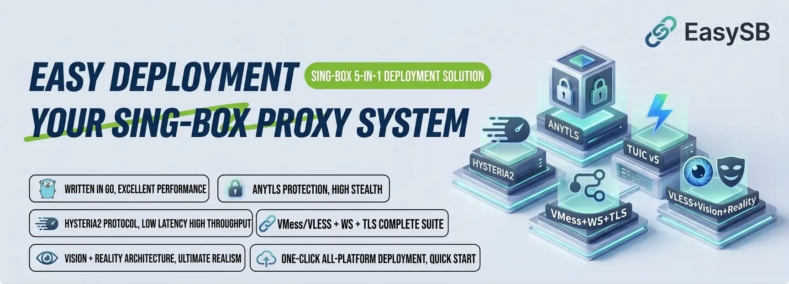

<div align="center">



**5-in-1 sing-box deployment script · readable config templates · one-click core management**

[](https://sing-box.sagernet.org/)

[](#supported-protocols)
[](#quick-start)

[简体中文](README_ZH.md) | **English**

<sub>AnyTLS · Hysteria2 · TUIC v5 · VMess + WebSocket + TLS · VLESS + Vision + Reality · Certificates · Subscription · Port hopping</sub>

</div>

---

## Table of Contents

- [Introduction](#introduction)
- [Repository Layout](#repository-layout)
- [Supported Protocols](#supported-protocols)
- [Quick Start](#quick-start)
- [Capabilities](#capabilities)
- [Interactive Menu](#interactive-menu)
- [Command Line](#command-line)
- [Non-interactive Install](#non-interactive-install)
- [Config Templates](#config-templates)
- [Subscription](#subscription)
- [Firewall and Port Hopping](#firewall-and-port-hopping)
- [Core Management](#core-management)
- [Developers: Build and Test](#developers-build-and-test)
- [Security Notes](#security-notes)
- [License](#license)

---

## Introduction

EasySB is a 5-in-1 sing-box deployment script for Linux VPS. It brings protocol deployment, certificate issuance, core version management and subscription generation into one interactive menu.

- **Go (primary implementation)**: a root Go module built with bubbletea / bubbles / lipgloss, compiled into a single static binary exposed as `sb`.
- **Templates**: `templates/` ships readable JSONC samples for the five protocols plus the subscription template. Use them on their own, or let the tool deploy them.
- **Core**: the sing-box binary comes from the official [SagerNet/sing-box](https://github.com/SagerNet/sing-box) releases. Stable and alpha builds can be installed, replaced or removed at any time.

- Homepage: https://github.com/MinimaxFlora/EasySB
- Core source: https://github.com/SagerNet/sing-box
- Changelog: [CHANGELOG.md](CHANGELOG.md)
- Contributing: [CONTRIBUTING.md](CONTRIBUTING.md)
- Security: [SECURITY.md](SECURITY.md)

---

## Repository Layout

```text
.
├── main.go                       # Go entrypoint (TUI)
├── install.sh                    # One-click installer (deps / binary / Nerd Font)
├── VERSION                       # Single source of truth for the release tag
├── AGENTS.md                     # Guide for AI agents and contributors
├── go.mod                        # Go module definition
├── internal/                     # Go packages, mapped in docs/architecture.md
├── templates/                    # Subscription and protocol config templates
│   ├── config/
│   │   ├── tun-fakeip.json       # sing-box TUN + FakeIP subscription template
│   │   └── mihomo.yaml           # mihomo / Clash Meta profile (readable mirror)
│   ├── anytls/                   # AnyTLS client / server samples
│   ├── hysteria2/                # Hysteria2 client / server samples
│   ├── tuic/                     # TUIC client / server samples
│   ├── vmess-websocket-tls/      # VMess + WebSocket + TLS samples
│   └── vless-vision-reality/     # VLESS + Vision + Reality samples
├── assets/                       # README banners
├── docs/                         # Engineering docs for agents and contributors
└── .github/                      # CI workflows and community health files
```

The protocol samples under `templates/` are readable JSONC; strip the comments and they work as sing-box server / client configs as-is.

---

## Supported Protocols

| Protocol | Transport | Default port | Highlights |
| :--- | :--- | :--- | :--- |
| AnyTLS | TCP + TLS | 8000 | Multi-stage Padding Scheme against traffic fingerprinting |
| Hysteria2 | QUIC / UDP | 8001 | Excellent on lossy networks, supports port hopping |
| TUIC v5 | QUIC / UDP | 8002 | 0-RTT handshake, `native` UDP relay, low latency |
| VLESS + Vision + Reality | TCP | 8003 | Certificate-free disguise, borrows `apple.com` by default |
| VMess + WebSocket + TLS | WS over TLS | 8004 | CDN and reverse-proxy friendly, standard TLS |

Ports are prompted one by one: Enter takes the default, `r` picks a random port, a number sets it manually. Conflicts with another protocol are rejected and re-prompted. Every protocol except VLESS + Reality requires a domain that already resolves to this host plus a valid certificate.

---

## Quick Start

One-click install (detects the system and architecture, fills in runtime dependencies, prefers a prebuilt binary with a source-build fallback, and installs a Nerd Font in local graphical environments):

```bash
bash <(curl -fsSL https://raw.githubusercontent.com/MinimaxFlora/EasySB/master/install.sh)
```

After installation, the shortcut opens the dark dashboard:

```bash
sb
```

Preset the language before entering the menu:

```bash
# Simplified Chinese
sb --language C

# English
sb --language E
```

Supports Debian / Ubuntu (systemd) and Alpine (OpenRC); run as root.

---

## Capabilities

| Capability | Description |
| :--- | :--- |
| 5-in-1 deployment | Ports allocated one by one; the node keeps only what no account owns (the Reality keypair), because credentials belong to accounts |
| Accounts and traffic | Per-account credentials for every protocol, traffic quota, expiry date, protocol selection, enable switch, usage reset and token rotation; disabled, expired and over-quota accounts drop out of the core automatically |
| Core management | Install, replace or remove stable and alpha builds; replace keeps the existing config |
| Version panel | Script version, local core, stable and alpha versions on top of the menu with update markers |
| Device panel | Local IPv4/IPv6, swap, uptime, CPU cores and load, memory, disk, host, kernel, OS and timezone |
| Copy links | Subscription and share-link results render as a card grid inside the same fixed panel as the main menu. Subscription cards show the subscription name (sing-box / mihomo / Base64) plus a format note, share-link cards show the protocol name, and neither draws the host or the full URL. Select with `↑`/`↓`/`←`/`→` (or a number key), `Enter` copies the card, `C` copies all, `Q` quits the program, `Esc` returns. A copied card turns green and copy-all reports in the header. Narrow or short windows reflow the grid and truncate content, never overflowing the panel. On log screens `C` copies the log (OSC52) |
| Certificates | acme.sh `--standalone` issue and renew, list, switch active, remove; handles 80 / 443 occupancy |
| Subscription | One URL per account (`/sub/<token>`) served by the built-in service, which picks the format from the client (`templates/config/tun-fakeip.json`, `templates/config/mihomo.yaml` or Base64 share links) and reports usage in `Subscription-Userinfo`; QR codes and per-protocol share links in the panel |
| Port hopping | Hysteria2 defaults to `2080:3000`, auto-applies iptables / nftables DNAT and a boot restore unit |
| Service control | Start, stop, restart, status and enable-on-boot |
| Self-update | Pulls the latest script from this repository and replaces it after validation |
| Bilingual | Language picked on first screen, consistent Chinese and English throughout |

---

## Interactive Menu

```text
Main menu
├── Core management      Install stable / alpha, switch channel, update current channel
├── Node management      One-click deploy, enable protocols, parameters (UUID / password / hop / ports / SNI / Reality keys)
├── Domain management    Issue / renew, list, switch active and remove certificates
├── Subscription         One account's URL, QR code and share links (pick the account first, then the panel prints the endpoint prefix); install / restart / status of the subscription service
├── Accounts and traffic List, create, rename, remark, quota, expiry, protocol selection, enable / disable, usage reset, token rotation, delete
├── Service management   Start, stop, restart, status, enable / disable and port-hopping rules
├── Update version       Pull the latest EasySB release
└── Uninstall script     Remove EasySB completely
```

Files: server config `/etc/sing-box/config.json`, state `/etc/sing-box/easysb.conf`, accounts `/etc/sing-box/easysb-users.json`, shortcut `/usr/local/bin/sb`.

---

## Command Line

| Flag | Description |
| :--- | :--- |
| `--language C\|E` | Preset the UI language, then open the menu |
| `--icons on\|off` | Override the Nerd Font icon detection result |
| `--theme auto\|dark\|light` | Override the terminal background detection (default `auto`) |
| `--apply-firewall` | Restore port-hopping rules only, used by the boot unit |
| `--render --width N --height N` | Render the dashboard once and exit (debug) |
| `--serve` | Run the subscription service and the usage accounting loop (backs `easysb.service`) |
| `--version` | Print the version and build hash |
| `--help` | Print usage |

---

## Config Templates

| Directory | Protocol | Transport | Disguise / encryption | Highlights |
| :--- | :--- | :--- | :--- | :--- |
| `templates/anytls/` | AnyTLS | TCP | TLS | Multi-stage Padding Scheme |
| `templates/hysteria2/` | Hysteria 2 | QUIC / UDP | TLS (ALPN `h3`) | Port hopping, strong on lossy links |
| `templates/tuic/` | TUIC | QUIC / UDP | TLS (ALPN `h3`) | 0-RTT handshake, `native` UDP relay |
| `templates/vmess-websocket-tls/` | VMess | WebSocket over TLS | TLS | CDN friendly, Early Data |
| `templates/vless-vision-reality/` | VLESS + Vision | TCP | REALITY (no cert) | `xtls-rprx-vision`, active-probing resistant |
| `templates/config/tun-fakeip.json` | TUN + FakeIP | System-wide | — | Rule routing, DNS split, URLTest |
| `templates/config/mihomo.yaml` | mihomo / Clash Meta | System-wide | — | Full client profile: proxies, groups, DNS, rules |

UUIDs, passwords, REALITY private keys and certificate paths in the templates are samples. Replace them before deployment and keep server and client in sync. Validate syntax with the core:

```bash
sing-box check -c templates/vless-vision-reality/config_server.json
```

---

## Subscription

Every account has one subscription URL, and the document behind it is rendered from `templates/config/tun-fakeip.json` (sing-box) or `templates/config/mihomo.yaml` (mihomo / Clash Meta) — or a Base64 share-link document for everything else. Delivery:

1. The built-in subscription service (`easysb --serve`, installed as `easysb.service` from the panel) answers `/sub/<token>` on `SUB_SERVE_PORT` (default `8443`).
2. A terminal QR code per client format, scannable once `qrencode` is installed.
3. Five per-protocol share links per account.

The format is negotiated from the User-Agent, so one URL works everywhere:

| Client | Response |
| :--- | :--- |
| sing-box (SFM / SFA / SFI) | JSON profile |
| mihomo / Clash Meta / luci-app-nikki | Complete YAML profile |
| v2rayN / passwall / passwall2 / homeproxy | Base64 share-link document |

The Base64 document is the universal format. v2rayN imports it directly, and the OpenWrt proxy clients `passwall`, `passwall2` and `homeproxy` base64-decode the same document before parsing it. `luci-app-nikki` uses the mihomo core and validates a top-level `proxies` key, which the mihomo profile carries. `?client=singbox|mihomo|v2ray` overrides the detection.

Every share link keeps the canonical hyphenated UUID. `homeproxy` validates the node UUID with the LuCI `uuid` check and rejects the 32-character hyphen-less form, so the compact form must not be emitted.

The account token in the URL is the access secret, and it is also the core user name the usage counters are keyed by. Revoke for one person by rotating that account's token or disabling it; nobody else is affected. Renaming an account leaves its token and client imports alone.

Each response carries `Subscription-Userinfo: upload=<bytes>; download=<bytes>; total=<bytes>; expire=<unix seconds>`, which Clash Verge Rev, Clash Orbit and v2rayN display as remaining traffic and days. An account that is disabled, expired or over quota gets `403` with a plain-text reason instead of a profile with no nodes in it, and the core stops accepting its credentials on the next accounting cycle. Traffic is sampled every `SUB_SYNC_SECONDS` (default `300`).

The service terminates TLS itself when a real certificate is installed for the domain; otherwise it serves plain HTTP and the panel warns, because a subscription carries credentials. The sing-box QR payload is wrapped as `sing-box://import-remote-profile?url=...` for one-scan import; mihomo and v2rayN QR payloads are the plain subscription URL, because Clash-family scanners fetch the scanned text directly as a profile URL (the `clash://install-config?url=...` deep link only works when clicked from a browser). sing-box listens for WebSocket directly; the subscription service never proxies traffic.

The mihomo profile mirrors a full desktop setup: `external-controller` on `0.0.0.0:9090` with `secret`, the Zashboard web UI via `external-ui-url`, fake-ip DNS with `fake-ip-filter`, `load-balance` / `url-test` / `select` proxy groups, and `GEOSITE` / `GEOIP` rules. Import it only on machines you trust on your LAN.

---

## Firewall and Port Hopping

Hysteria2 port hopping applies standard NAT rules to a UDP port range:

```bash
# iptables
iptables -t nat -A PREROUTING -p udp --dport 2080:3000 -j REDIRECT --to-ports 8001

# nftables
nft add table ip nat
nft 'add chain ip nat prerouting { type nat hook prerouting priority dstnat; }'
nft add rule ip nat prerouting udp dport 2080-3000 redirect to :8001
```

NAT rules do not survive a reboot, so the script creates a boot restore unit:

- systemd: `easysb-firewall.service` (oneshot, starts before `sing-box.service`).
- OpenRC: `/etc/init.d/easysb-firewall`.

The unit restores rules via `easysb --apply-firewall`. It is not created when Hysteria2 port hopping is disabled.

---

## Core Management

| Item | Description |
| :--- | :--- |
| Core source | Official `SagerNet/sing-box` releases; the tool downloads official assets directly |
| Stable | Official latest release |
| Alpha | Official prerelease |
| Install | Downloads and verifies for the architecture, writes `/etc/sing-box/sing-box` |
| Replace | Swaps the binary only, keeps `/etc/sing-box/config.json` |
| Uninstall | Stops the service and removes the core |
| Release | `.github/workflows/easysb-go-release.yml` cross-compiles every platform binary and publishes them under the `v<VERSION>` tag (currently `v4.0.0`) |

---

## Developers: Build and Test

Go implementation (primary, requires Go 1.27.1; `go.mod` declares `go 1.27.1`, and `GOTOOLCHAIN=auto` fetches that toolchain automatically). `internal/tui/` holds the TUI shell and interaction logic; the other packages under `internal/` cover the core, certificate, service, subscription and firewall modules, mapped in `docs/architecture.md`:

```bash
# Build the binary
go build -o easysb .

# Run tests
go test ./...

# Render the dashboard once without interaction (preview / screenshot / debug)
./easysb --render --width 100 --height 34

# Switch language, icon mode and theme
./easysb --language E --icons off --theme dark
```

---

## Security Notes

> UUIDs, passwords, REALITY private keys and certificate paths in this repository are samples. Using them in production is equivalent to having no protection.

- Regenerate every key and UUID before deployment, and keep server and client strictly in sync.
- A REALITY private key belongs on the server only. Never commit it to a public repository.
- Use a real domain and a valid certificate for certificate-based protocols, and tighten certificate file permissions to `600`.
- Follow local laws and use this project only in network environments you are authorized to operate.

Report security issues privately as described in [SECURITY.md](SECURITY.md) instead of opening a public issue.

---

## License

This project is licensed under **GPL-3.0**. See [LICENSE](LICENSE) for the full text.

Copyright (C) 2026 MinimaxFlora. Redistribution and modification must continue to follow GPL-3.0.

<div align="center">

**Built for sing-box · 5-in-1 deployment, straight from the menu.**

GPL-3.0 License © [MinimaxFlora](https://github.com/MinimaxFlora)

</div>
