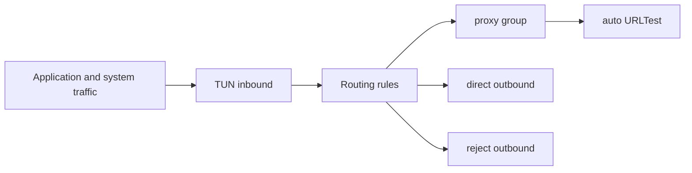

<div align="center">

# EasySB

**A sing-box config template collection plus a one-click deployment script · readable templates · one-command setup**

[](https://sing-box.sagernet.org/)

[](#protocols-supported-by-easysb)
[](#quick-start)

[简体中文](README.md) | **English**

<sub>VLESS · Vision · REALITY · VMess · WebSocket · Hysteria2 · TUIC · AnyTLS · ShadowTLS · Shadowsocks · Trojan · NaiveProxy · TUN · FakeIP</sub>

</div>

---

## Table of Contents

- [Introduction](#introduction)
- [Repository Layout](#repository-layout)
- [Quick Start](#quick-start)
- [EasySB Capabilities](#easysb-capabilities)
- [Protocols Supported by EasySB](#protocols-supported-by-easysb)
- [EasySB Command Line Options](#easysb-command-line-options)
- [Configuration Template Matrix](#configuration-template-matrix)
- [Subscription Templates](#subscription-templates)
- [Choosing a Protocol](#choosing-a-protocol)
- [Kernel and Release Pipeline](#kernel-and-release-pipeline)
- [Security Notes](#security-notes)
- [Contributing](#contributing)
- [License](#license)

---

## Introduction

This repository offers two ways to use sing-box, and you can pick either one:

1. **Configuration templates**: the `VLESS-Vision-Reality/`, `VMess-WebSocket-TLS/`, `Hysteria2/`, `Tuic/` and `AnyTLS/` directories each ship a matching `config_server.json` and `config_client.json` pair, and `Templates/tun-fakeip.json` provides a system-wide transparent proxy template. Every config is written in JSONC (JSON with comments), with each key field annotated inline.
2. **The EasySB deployment script**: the `EasySB/` directory holds the script source. It deploys 12 protocols to a Linux VPS in one pass, covering certificate issuance, port assignment, masquerade sites, node export, subscription generation and self-update.

EasySB is a refactor of [fscarmen/sing-box](https://github.com/fscarmen/sing-box). Features, menus and interactive options match the upstream project exactly. The only differences are that every remote endpoint now points at this repository, and the source is split into readable modules.

- Homepage: https://github.com/MinimaxFlora/EasySB
- Reference project: https://github.com/fscarmen/sing-box
- Changelog: [CHANGELOG.md](CHANGELOG.md)
- Contributing guide: [CONTRIBUTING.md](CONTRIBUTING.md)
- Security policy: [SECURITY.md](SECURITY.md)

---

## Repository Layout

```text
.
├── EasySB/                       # One-click deployment script
│   ├── lib/                      # Source modules, numbered in concatenation order (19 files)
│   ├── tests/                    # Test suites (build / i18n / static / lint)
│   ├── docs/FEATURE-MAP.md       # Requirement to implementation mapping
│   ├── build.sh                  # Concatenate modules and validate syntax
│   ├── config.conf               # Non-interactive install config template
│   ├── force_version             # Pinned kernel version file
│   └── dist/                     # Build output, git-ignored, published to Releases only
├── Templates/                    # Client subscription and global proxy templates
│   ├── config.yaml               # Clash / Mihomo subscription
│   ├── config-rule.yaml          # Clash / Mihomo subscription
│   ├── config.json               # sing-box SFM / SFA / SFI subscription
│   └── tun-fakeip.json           # TUN global proxy with FakeIP
├── VLESS-Vision-Reality/         # Protocol templates
├── VMess-WebSocket-TLS/          # Protocol templates
├── Hysteria2/                    # Protocol templates
├── Tuic/                         # Protocol templates
├── AnyTLS/                       # Protocol templates
├── Release/                      # Upstream sing-box packaging files (systemd / shell completion / build scripts)
└── .github/                      # CI workflows and community health files
```

---

## Quick Start

### Option 1: The EasySB script

First install. The script detects your system, installs dependencies and walks you through protocol selection:

```bash
bash <(curl -fsSL https://github.com/MinimaxFlora/EasySB/releases/download/easysb/easysb.sh)
```

After installation, run the shortcut command:

```bash
sb
```

Install with an explicit language, or use defaults for every option:

```bash
# Chinese quick install / English quick install
bash <(curl -fsSL https://github.com/MinimaxFlora/EasySB/releases/download/easysb/easysb.sh) -l
bash <(curl -fsSL https://github.com/MinimaxFlora/EasySB/releases/download/easysb/easysb.sh) -k
```

### Option 2: Use the templates manually

```bash
# Clone the repository
git clone https://github.com/MinimaxFlora/EasySB.git

# Enter a protocol directory
cd EasySB/VLESS-Vision-Reality

# Validate the configuration
sing-box check -c config_server.json
```

Every UUID, password, REALITY private key and certificate path in the templates is a placeholder. Regenerate them before deployment and keep the server and client in sync.

### For developers: build and test

`EasySB/lib/` is the single source of truth. `dist/` is generated and never committed:

```bash
# Build the release script
bash EasySB/build.sh

# Validate only, write nothing
bash EasySB/build.sh --check

# Run the full test suite
bash EasySB/tests/run-tests.sh
```

---

## EasySB Capabilities

| Capability | Description |
| :--- | :--- |
| Multi-protocol | Choose any of 12 protocols, all selected by default. TCP and UDP ports are assigned automatically without conflicts |
| Domain-based setup | Client address, SNI and certificates are all tied to your domain, which is safer and harder to probe than a bare IP |
| Certificate management | Driven by acme.sh: issue (standalone / webroot / DNS API), list, select, delete and renew |
| Kernel install and update | Installs the sing-box binary built in this repository's [Releases](https://github.com/MinimaxFlora/EasySB/releases), shows current and latest versions, and updates in one step |
| Script self-update | Pulls the latest script, validates syntax, then replaces atomically and keeps a rollback copy |
| Masquerade site | Optionally deploy a blog, corporate site, blank page, custom HTML or a reverse proxy to a real site, doubling as the ACME webroot |
| Node export | Generates a `config_client.json` per protocol, a combined `all.json`, and share links with QR codes |
| Subscription URLs | Import every node with one URL: Base64, plain text links, sing-box JSON, and Clash / Mihomo YAML. Refreshed automatically on config change, with token path auth that you can reset |
| Add or remove protocols | Add or drop protocols after installation without reinstalling |
| Bilingual | The whole flow works in Chinese and English with identical menu options |

See [EasySB/README.md](EasySB/README.md) for details and [EasySB/docs/FEATURE-MAP.md](EasySB/docs/FEATURE-MAP.md) for the requirement to implementation mapping.

---

## Protocols Supported by EasySB

Protocol codes are used by `--CHOOSE_PROTOCOLS` and the install wizard. `a` means all, and `b` through `m` can be combined freely:

| Code | Protocol | Transport | Highlights |
| :--- | :--- | :--- | :--- |
| `b` | VLESS + Reality | TCP | Certificate-free masquerade, resistant to active probing |
| `c` | Hysteria2 | QUIC / UDP | Excellent on lossy networks, supports port hopping |
| `d` | Tuic V5 | QUIC / UDP | 0-RTT handshake, `native` UDP relay, low latency |
| `e` | ShadowTLS | TCP | Borrows a real TLS site, resists SNI blocking |
| `f` | Shadowsocks | TCP / UDP | Lightweight and broadly compatible |
| `g` | Trojan | TCP | Standard TLS semantics, easy to disguise |
| `h` | VMess + WebSocket | WS over TLS | Traverses CDNs and Nginx reverse proxies |
| `i` | VLESS + WebSocket + TLS | WS over TLS | CDN friendly, supports Early Data |
| `j` | VLESS + H2 + Reality | HTTP/2 | Certificate-free, HTTP/2 transport |
| `k` | VLESS + gRPC + Reality | gRPC | Certificate-free, gRPC transport |
| `l` | AnyTLS | TCP | Multi-stage padding scheme against traffic fingerprinting |
| `m` | NaiveProxy | HTTP/2 | Reuses the Chromium network stack, traffic resembles a real browser |

---

## EasySB Command Line Options

| Option | Description |
| :--- | :--- |
| `-c` / `-e` | Chinese / English |
| `-l` / `-k` | Quick install in Chinese / English, filling in every option automatically |
| `-u` | Uninstall |
| `-n` | Show node information |
| `-d` | Modify configuration |
| `-s` | Stop or start the Sing-box service |
| `-a` | Stop or start the Argo Tunnel service |
| `-t` | Replace the Argo tunnel |
| `-v` | Sync sing-box to the latest version |
| `-b` | Upgrade the kernel, install BBR or run the DD script |
| `-r` | Add or remove protocols |

### Non-interactive install

`EasySB/config.conf` is a KV config template. Edit it and run:

```bash
bash <(curl -fsSL https://github.com/MinimaxFlora/EasySB/releases/download/easysb/easysb.sh) -f config.conf
```

The same values can be passed as command line KV pairs:

```bash
bash <(curl -fsSL https://github.com/MinimaxFlora/EasySB/releases/download/easysb/easysb.sh) \
  --LANGUAGE e \
  --CHOOSE_PROTOCOLS a \
  --START_PORT 8881 \
  --SERVER_IP 123.123.123.123 \
  --CDN skk.moe \
  --UUID_CONFIRM 20f7fca4-86e5-4ddf-9eed-24142073d197 \
  --SUBSCRIBE=true \
  --ARGO=true \
  --NODE_NAME_CONFIRM bucket
```

Every supported KV key maps one to one with `config.conf`.

---

## Configuration Template Matrix

| Directory | Protocol | Transport | Masquerade / Encryption | Highlights |
| :--- | :--- | :--- | :--- | :--- |
| `VLESS-Vision-Reality/` | VLESS + Vision | TCP | REALITY, no certificate | `xtls-rprx-vision` flow control, borrows a real site certificate, resists active probing |
| `VMess-WebSocket-TLS/` | VMess | WebSocket over TLS | Certificate TLS | Mux multiplexing, 0-RTT Early Data, CDN friendly |
| `Hysteria2/` | Hysteria 2 | QUIC / UDP | TLS, ALPN `h3` | Port hopping, BBR, strong on lossy links |
| `Tuic/` | TUIC | QUIC / UDP | TLS, ALPN `h3` | 0-RTT handshake, `native` UDP relay, low latency |
| `AnyTLS/` | AnyTLS | TCP | Certificate TLS | Multi-stage padding scheme against traffic analysis |
| `Templates/tun-fakeip.json` | TUN + FakeIP | System wide | — | Rule based routing, split DNS, URLTest auto selection |

Routing architecture of the TUN template:



DNS is layered: FakeIP handles regular lookups to speed up connection setup, domestic domains resolve through `223.5.5.5` for locality, and the fallback resolution goes over the proxy as DoH to avoid poisoning.

---

## Subscription Templates

All subscription templates come from the `Templates/` directory of this repository. The script renders them and serves the result from the subscription site:

| Template | Purpose | Placeholder / Anchor |
| :--- | :--- | :--- |
| `Templates/config.yaml` | Clash / Mihomo subscription pulling nodes via `proxy-providers` | `NODE_NAME`, `PROXY_PROVIDERS_URL` |
| `Templates/config-rule.yaml` | Clash / Mihomo subscription with nodes and rules embedded | Inserts at the `proxy-groups:` and `rules:` anchors |
| `Templates/config.json` | sing-box SFM / SFA / SFI subscription | `<OUTBOUND_REPLACE>`, `<NODE_REPLACE>` |

The subscription endpoints are `/clash`, `/clash2` and `/sing-box`, with `/auto` and `/auto2` as the user-agent based auto-detection entries.

---

## Choosing a Protocol

| Scenario | Recommended | Why |
| :--- | :--- | :--- |
| Maximum resistance to blocking | VLESS + Vision + REALITY | No certificate, borrows a real site, resists active probing |
| Behind a CDN or reverse proxy | VMess / VLESS + WebSocket + TLS | WebSocket is proxyable by standard HTTP infrastructure |
| Lossy or long haul cross-border links | Hysteria2 | QUIC plus BBR plus port hopping performs best on lossy links |
| Gaming and real-time media | TUIC | `native` UDP relay with the lowest latency |
| Resistance to traffic fingerprinting | AnyTLS or NaiveProxy | Multi-stage padding and a browser network stack resemble real traffic |
| System-wide transparent proxy | `Templates/tun-fakeip.json` | Takes over all traffic with rule routing and auto selection |

---

## Kernel and Release Pipeline

| Stage | Location | Description |
| :--- | :--- | :--- |
| Kernel build | `.github/workflows/build-release.yml` | Checks the upstream version on a schedule, builds multi-architecture sing-box binaries, and publishes them to this repository's Releases |
| Script assembly | `EasySB/build.sh` | Concatenates `lib/*.sh` in numeric order into a single release file |
| Script release | `.github/workflows/easysb-release.yml` | Builds and tests, then publishes `EasySB/dist/easysb.sh` under the fixed tag `easysb` |
| Version pinning | `EasySB/force_version` | Locks the kernel to a known good version if a release misbehaves |

The kernel download URL, the pinned version file and the script's own URL all point at this repository rather than upstream.

---

## Security Notes

> Every UUID, password, REALITY private key and certificate path in this repository is a placeholder. Using them as-is in production offers no protection.

- Regenerate every key and UUID before deployment, and keep the server and client strictly in sync.
- The REALITY private key belongs on the server only. Never commit it to a public repository.
- Certificate based protocols need a real domain and a valid certificate. Tighten certificate file permissions to `600`.
- Follow the laws and regulations of your jurisdiction, and use this project only on networks you are authorized to use.

To report a security issue, follow [SECURITY.md](SECURITY.md) and report it privately instead of opening a public issue.

---

## Contributing


---

## License

This project is licensed under **GPL-3.0**. The full text is in [LICENSE](LICENSE).

EasySB is a refactor of [fscarmen/sing-box](https://github.com/fscarmen/sing-box). The original project is copyright fscarmen, and the refactored work is copyright MinimaxFlora. This project is a GPL-3.0 derivative work, so redistribution and modification must also follow GPL-3.0.

<div align="center">

**Built for sing-box · Keep it readable, keep it reliable.**

GPL-3.0 License © [MinimaxFlora](https://github.com/MinimaxFlora)

</div>
