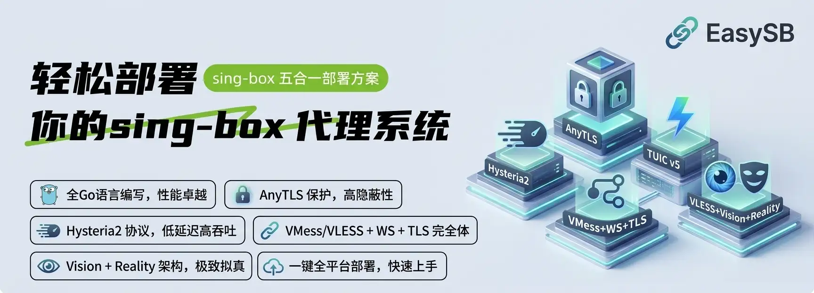

<div align="center">



**sing-box 五合一部署脚本 · 配置模板开箱可读 · 内核版本一键管理**

[](https://sing-box.sagernet.org/)

[](#easysb-支持协议)
[](#快速开始)

**简体中文** | [English](README.md)

<sub>AnyTLS · Hysteria2 · TUIC v5 · VMess + WebSocket + TLS · VLESS + Vision + Reality · 证书 · 订阅 · 端口跳跃</sub>

</div>

---

## 目录

- [项目简介](#项目简介)
- [仓库结构](#仓库结构)
- [支持的协议](#支持的协议)
- [快速开始](#快速开始)
- [EasySB 能力](#easysb-能力)
- [交互菜单](#交互菜单)
- [命令参数](#命令参数)
- [无交互安装](#无交互安装)
- [配置模板](#配置模板)
- [订阅](#订阅)
- [防火墙与端口跳跃](#防火墙与端口跳跃)
- [工具箱](#工具箱)
- [开发者：构建与测试](#开发者构建与测试)
- [安全须知](#安全须知)
- [开源协议](#开源协议)

---

## 项目简介

EasySB 是一个面向 Linux VPS 的 sing-box 五合一部署工具，把协议部署、证书申请、服务解锁检测、订阅生成统一到一套交互式菜单里。

- **Go 版（当前主实现）**：根目录 Go module，基于 bubbletea / bubbles / lipgloss 的深色仪表盘 TUI，编译为单一静态二进制并以 `sb` 呼出。
- **模板**：`templates/` 存放五个协议的 JSONC 配置样例与订阅模板，既可以只用模板，也可以交给程序自动落地。
- **内核**：sing-box **已编译进面板本体**——`github.com/sagernet/sing-box` 是 `go.mod` 的直接依赖，装上面板就有内核，节点就是 `easysb core run`；没有任何内核二进制要下载、替换或切换，账号流量统计也随构建一起带上（`with_v2ray_api`，见 `release/TAGS`）。
- **证书**：用 `go-acme/lego` 在面板自己的进程里申请 Let's Encrypt 证书，不再下载 acme.sh，也不需要 socat。

- 项目地址：https://github.com/MinimaxFlora/EasySB
- 内核来源（已编译进面板）：https://github.com/SagerNet/sing-box
- 变更记录：[CHANGELOG.md](CHANGELOG.md)
- 贡献指南：[CONTRIBUTING.md](CONTRIBUTING.md)
- 安全策略：[SECURITY.md](SECURITY.md)

---

## 仓库结构

```text
.
├── main.go                       # Go 入口（TUI 主程序）
├── install.sh                    # 一键安装脚本（依赖 / 二进制）
├── VERSION                       # 发布 tag 的唯一来源
├── AGENTS.md                     # 面向 AI Agent 与协作者的说明
├── go.mod                        # Go module 定义
├── internal/                     # Go 实现，包职责见 docs/architecture.md
├── templates/                    # 订阅与协议配置模板
│   ├── config/
│   │   ├── tun-fakeip.json       # sing-box TUN + FakeIP 订阅模板
│   │   └── mihomo.yaml           # mihomo / Clash Meta 配置（可读镜像）
│   ├── anytls/                   # AnyTLS 协议客户端 / 服务端样例
│   ├── hysteria2/                # Hysteria2 协议客户端 / 服务端样例
│   ├── tuic/                     # TUIC 协议客户端 / 服务端样例
│   ├── vmess-websocket-tls/      # VMess + WebSocket + TLS 样例
│   └── vless-vision-reality/     # VLESS + Vision + Reality 样例
├── assets/                       # README 横幅
├── docs/                         # 面向 Agent 与协作者的工程文档
└── .github/                      # CI 工作流与社区健康文件
```

`templates/` 下的协议样例为可直接阅读的 JSONC，去注释后即可作为 sing-box 服务端 / 客户端配置使用。

---

## 支持的协议

| 协议 | 承载 | 默认端口 | 特点 |
| :--- | :--- | :--- | :--- |
| AnyTLS | TCP + TLS | 8000 | Padding Scheme 多阶段填充，对抗流量指纹 |
| Hysteria2 | QUIC / UDP | 8001 | 弱网与高丢包场景表现优秀，支持端口跳跃 |
| TUIC v5 | QUIC / UDP | 8002 | 0-RTT 握手，`native` UDP 转发，低延迟 |
| VLESS + Vision + Reality | TCP | 8003 | 免证书伪装，默认偷用 `apple.com`，抗主动探测 |
| VMess + WebSocket + TLS | WS over TLS | 8004 | 可穿 CDN 与反向代理，基于标准 TLS |

端口在安装时逐一询问：回车取默认值，输入 `r` 随机，输入数字手动指定；与其他协议冲突时会提示重新设置。除 VLESS + Reality 外的协议都需要一个已解析到本机的域名与有效证书。

---

## 快速开始

Go 版（当前主实现）一键安装：脚本会检测系统与架构，补全运行依赖，优先下载预编译二进制（回退源码构建）：

```bash
bash <(curl -fsSL https://raw.githubusercontent.com/MinimaxFlora/EasySB/master/install.sh)
```

安装完成后以快捷指令 `sb` 启动深色仪表盘。

再次运行只需输入快捷指令：

```bash
sb
```

预设语言后进入菜单：

```bash
# 简体中文
sb --language C

# English
sb --language E
```

支持 Debian / Ubuntu（systemd）与 Alpine（OpenRC）；需要 root 权限运行。

---

## EasySB 能力

| 能力 | 说明 |
| :--- | :--- |
| 五协议部署 | 端口逐一编排；节点只保留不属于账号的材料（Reality 密钥对），账号凭据归各账号所有 |
| 账号与流量 | 每个账号在每个协议上拥有独立凭据，支持流量限额、有效期、可用协议、启用开关、重置流量与更换令牌；停用、过期、超额账号自动从内核配置中移除 |
| 服务解锁状态 | 检测当前 IP 的真实可用情况：Netflix（含「仅原创」判定）、Disney+、YouTube Premium、Amazon Prime Video、DAZN、TVBAnywhere+、Spotify、Reddit、TikTok、ChatGPT、Gemini、Claude、Steam、Bilibili 中国大陆 / 港澳台 / 台湾、巴哈姆特動畫瘋，共 17 项；每项只发 1-3 个请求，结论分为解锁 / 部分解锁 / 屏蔽 / 检测失败并给出原因，判断不出结论时如实报失败，不猜「解锁」 |
| 内核在面板里 | sing-box 是 `go.mod` 的直接依赖：节点就是 `easysb core run -c /etc/sing-box/config.json`，版本行直接读面板里编译进的那个版本；`easysb core check` 用同一套引擎校验配置，账号流量统计取决于构建是否带 `with_v2ray_api`（`release/TAGS`），面板会如实显示而不是假定 |
| 版本面板 | 程序版本与面板内编译的 sing-box 版本，并标明本次构建能否统计流量 |
| 设备面板 | 本机 IPv4/IPv6、交换空间、运行时间、CPU 核心数与负载、内存、磁盘、主机、内核、系统与时区 |
| 系统信息 | 查看面板运行环境，并能在界面内直接换外观：`↑`/`↓` 加 `Enter` 或 `A`-`D` 选皮肤，`T` 切深浅配色，`I` 在 Unicode 符号与纯 ASCII 之间切换。改完下一帧就生效（主题从此不再跟随终端），字形预览一行可以在其他卡片出问题前先看出终端字体能不能显示这些字形；切换时顶部状态条与底部按键提示保持不动，只有正文换掉 |
| 复制链接 | 订阅与分享链接以卡片网格呈现在与主菜单同尺寸的固定面板里；订阅卡片显示订阅名（sing-box / mihomo / Base64 订阅）与格式说明，分享链接卡片显示协议名，均不显示主机或完整 URL。`↑`/`↓`/`←`/`→`（或数字键）选择，`Enter` 复制当前项，`C` 复制全部，`Q` 退出程序，`Esc` 返回；复制成功的卡片变成成功色，复制全部在页头提示。窗口变窄变矮时网格自动减少列数并截断内容，面板不溢出。日志页 `C` 复制日志（OSC52） |
| 证书管理 | 内置 lego 走 HTTP-01 standalone 直接申请 Let's Encrypt 证书：申请、查看、切换激活、删除；申请前先检查域名解析，申请时先停内核腾出 80 端口，全程无需下载任何脚本或额外监听工具。续期按到期时间判断（提前 30 天），由面板自己的 systemd timer / OpenRC 脚本驱动，续期后自动重载 sing-box 与订阅服务 |
| 订阅生成 | 每个账号一个订阅地址（`/sub/<令牌>`），由内置订阅服务按客户端自动选择格式（`templates/config/tun-fakeip.json`、`templates/config/mihomo.yaml` 或 Base64 分享链接），并通过 `Subscription-Userinfo` 上报用量；面板提供二维码与各协议分享链接 |
| 端口跳跃 | Hysteria2 默认 `2080:3000`，自动下发 iptables / nftables DNAT，并生成开机恢复单元 |
| 服务管理 | 启动、停止、重启、查看状态与开机自启 |
| BBR 加速 | 查看运行内核、拥塞算法、队列算法与已装内核；启用 BBR（加载 `tcp_bbr`、写 `net.core.default_qdisc` 与 `net.ipv4.tcp_congestion_control`，并落盘到 `/etc/sysctl.d/99-easysb-bbr.conf`、`/etc/modules-load.d/easysb-bbr.conf`，重启后仍生效）；安装 [Linux-BBR-v3](https://github.com/MinimaxFlora/Linux-BBR-v3) 发布的预编译 BBRv3 内核（标准版 / Max 版，x86_64 与 arm64，直接从 GitHub release 下载），也可以从版本列表里挑任意一个已发布版本安装；卸载内核、清空配置都能在面板里完成。版本号全部来自内核项目本身（`version.ini` 与 release 列表），对面发了新内核，这里打开列表就能看到，不需要面板再发版 |
| 脚本自更新 | 从本仓库拉取最新脚本，校验通过后替换 |
| 中英双语 | 启动首屏选择语言，全流程界面一致 |

---

## 交互菜单

```text
主菜单（整幅卡片内左右两列，共 10 项）
├── 服务解锁状态 检测 ChatGPT / Netflix 等服务的解锁情况
├── 节点管理     一键部署、启用协议、参数设置（端口跳跃 / 端口 / 偷用域名 / Reality 密钥 / 订阅端口 / 统计间隔）
├── 域名管理     申请证书（含环境与解析预检）、立即续期、续期定时器、查看、切换激活、删除
├── 订阅管理     某账号的订阅地址 / 二维码 / 分享链接（先选账号，再输出订阅地址前缀）、订阅服务的安装 / 重启 / 状态
├── 账号管理     账号列表、新建、重命名、备注、流量限额、有效期、可用协议、启用 / 停用、重置流量、更换令牌、删除
├── 服务管理     启动 / 停止 / 重启 / 状态 / 开机自启、端口跳跃规则
├── 系统信息     运行环境、外观切换（皮肤 / 深浅 / 标记 / 语言）、终端与设备信息
├── BBR 管理     查看 BBR 状态、启用加速（fq / fq_codel / fq_pie / cake）、安装标准版或 Max 版 BBRv3 内核、选择版本安装（列出所有已发布版本）、卸载内核、清空配置
├── 版本更新     拉取最新 EasySB 发行版
└── 卸载脚本     完整卸载 EasySB
```

对应文件：服务端配置 `/etc/sing-box/config.json`，状态 `/etc/sing-box/easysb.conf`，账号 `/etc/sing-box/easysb-users.json`，快捷指令 `/usr/local/bin/sb`。

---

## 命令参数

| 参数 | 说明 |
| :--- | :--- |
| `--language C\|E` | 预设界面语言后进入菜单 |
| `--icons symbols\|ascii` | 标记方案：Unicode 符号（默认）或纯 ASCII（也可用 `on`/`off`；边框仍随皮肤） |
| `--theme auto\|dark\|light` | 覆盖终端背景检测（默认 `auto`，亮色终端自动换用浅色配色） |
| `--skin jade\|aurora\|ember\|graphite` | 选择界面皮肤，也可用 `a`-`d`（默认 `jade`，环境变量 `EASYSB_SKIN`） |
| `--apply-firewall` | 仅恢复端口跳跃规则，供开机单元调用 |
| `--renew-certs` | 续期全部证书，仅在确有证书被续期时重载 sing-box 与订阅服务（供续期定时器调用） |
| `--install-renew-timer` | 安装证书续期定时器（systemd timer / OpenRC），单元内记录本二进制的路径 |
| `--remove-renew-timer` | 移除证书续期定时器 |
| `--render --width N --height N` | 渲染一次仪表盘后退出（调试用；加 `--screen system` 可渲染子页面） |
| `--serve` | 运行订阅服务与流量统计循环（`easysb.service` 使用该模式） |
| `--version` | 显示版本与构建短哈希 |
| `--help` | 显示用法 |

---

## 配置模板

| 目录 | 协议 | 承载层 | 伪装 / 加密 | 关键能力 |
| :--- | :--- | :--- | :--- | :--- |
| `templates/anytls/` | AnyTLS | TCP | 证书 TLS | Padding Scheme 多阶段填充 |
| `templates/hysteria2/` | Hysteria 2 | QUIC / UDP | TLS（ALPN `h3`） | 端口跳跃、弱网表现优秀 |
| `templates/tuic/` | TUIC | QUIC / UDP | TLS（ALPN `h3`） | 0-RTT 握手、`native` UDP 转发 |
| `templates/vmess-websocket-tls/` | VMess | WebSocket over TLS | 证书 TLS | 可穿 CDN、Early Data |
| `templates/vless-vision-reality/` | VLESS + Vision | TCP | REALITY（免证书） | `xtls-rprx-vision`、抗主动探测 |
| `templates/config/tun-fakeip.json` | TUN + FakeIP | 系统全局 | — | 规则分流、DNS 拆分、URLTest 自动测速 |
| `templates/config/mihomo.yaml` | mihomo / Clash Meta | 系统全局 | — | 完整客户端配置：节点、策略组、DNS、规则 |

模板中的 UUID、密码、REALITY 私钥与证书路径全部是示例值，部署前必须替换，且服务端与客户端保持一致。可先用内核校验语法：

```bash
sing-box check -c templates/vless-vision-reality/config_server.json
```

---

## 订阅

每个账号只有一个订阅地址，其文档分别基于 `templates/config/tun-fakeip.json`（sing-box）与 `templates/config/mihomo.yaml`（mihomo / Clash Meta）渲染，其余客户端使用 Base64 分享链接文档。交付方式：

1. 内置订阅服务（面板中的「安装订阅服务」写入 `easysb.service`，以 `easysb --serve` 运行）在 `SUB_SERVE_PORT`（默认 `8443`）上响应 `/sub/<令牌>`。
2. 各客户端格式的终端二维码，安装 `qrencode` 后可直接扫码导入。
3. 每个账号五类分享链接，覆盖主流客户端。

格式由 User-Agent 协商，因此一个地址通用：

| 客户端 | 返回内容 |
| :--- | :--- |
| sing-box（SFM / SFA / SFI） | JSON 配置 |
| mihomo / Clash Meta / luci-app-nikki | 完整 YAML 配置 |
| v2rayN / passwall / passwall2 / homeproxy | Base64 分享链接文档 |

Base64 文档即通用格式。v2rayN 可直接导入，OpenWrt 上的 `passwall`、`passwall2`、`homeproxy` 也会先对同一份文档做 Base64 解码再逐行解析。`luci-app-nikki` 使用 mihomo 内核，订阅必须含顶层 `proxies`，mihomo 配置已包含该字段。可用 `?client=singbox|mihomo|v2ray` 强制指定格式。

所有分享链接都保留标准的带连字符 UUID。`homeproxy` 会用 LuCI 的 `uuid` 校验节点，32 位无连字符形式会被判为无效，因此不能输出紧凑形式。

订阅地址中的账号令牌即访问密钥，同时也是内核侧统计计数所使用的用户名。要单独收回某人权限，只需更换该账号令牌或停用该账号，其他人不受影响；重命名账号不会改变令牌，客户端导入无需重做。

每次响应都会带上 `Subscription-Userinfo: upload=<字节>; download=<字节>; total=<字节>; expire=<unix 秒>`，Clash Verge Rev、Clash Orbit 与 v2rayN 可直接显示剩余流量与剩余天数。停用、过期或超额的账号不会收到「没有节点」的半成品配置，而是收到 `403` 与纯文本原因，并在下一个统计周期从内核配置中移除。流量每 `SUB_SYNC_SECONDS`（默认 `300`）秒采样一次。

域名下存在真实证书时由订阅服务自行终结 TLS；否则以明文 HTTP 提供服务并在面板中提示，因为订阅内容包含账号凭据。sing-box 二维码会包装为 `sing-box://import-remote-profile?url=...` 以便扫码导入；mihomo 与 v2rayN 二维码使用纯订阅地址，因为 Clash 系客户端扫码后会把内容直接当作订阅 URL 抓取（`clash://install-config?url=...` 仅在浏览器点击深链时有效）。sing-box 直接监听 WebSocket，订阅服务只负责下发配置，不做流量转发。

mihomo 配置对齐完整桌面方案：`external-controller` 监听 `0.0.0.0:9090` 并带 `secret`，通过 `external-ui-url` 加载 Zashboard 面板，DNS 使用 fake-ip 与 `fake-ip-filter`，策略组包含 `load-balance` / `url-test` / `select`，分流规则包含 `GEOSITE` / `GEOIP`。请仅在局域网内可信设备上导入。

---

## 防火墙与端口跳跃

Hysteria2 端口跳跃使用标准 NAT 规则，对 UDP 端口区间做 DNAT：

```bash
# iptables
iptables -t nat -A PREROUTING -p udp --dport 2080:3000 -j REDIRECT --to-ports 8001

# nftables
nft add table ip nat
nft 'add chain ip nat prerouting { type nat hook prerouting priority dstnat; }'
nft add rule ip nat prerouting udp dport 2080-3000 redirect to :8001
```

NAT 规则重启即失效，因此脚本会生成开机恢复单元：

- systemd：`easysb-firewall.service`（oneshot，早于 `sing-box.service`）。
- OpenRC：`/etc/init.d/easysb-firewall`。

单元通过 `easysb --apply-firewall` 恢复规则，不使用 Hysteria2 端口跳跃时不会创建该单元。

---

## 工具箱

工具箱（主菜单第 1 项，占原来「服务解锁状态」的位置）把「这台机器到底能干什么」的测量集中在一处：每项一个条目、每项一份报告、看板记住每项上次的结果。**打开页面不会自动跑任何东西**——测速、回程、跑分都不是按一下方向键就该开始的事。

| 分组 | 条目 |
| :--- | :--- |
| 解锁检测 | 流媒体解锁（Netflix、Disney+、YouTube Premium、Prime Video、DAZN、TVBAnywhere+、Spotify、Reddit、TikTok）、AI 解锁（ChatGPT、Gemini、Claude）、区域解锁（Steam、Bilibili 三个区域、巴哈姆特動畫瘋） |
| 网络检测 | 三网回程（到电信/联通/移动的路径与回程线路）、就近测速、三网测速 |
| IP 与端口 | IP 质量（多家数据库 + DNS 黑名单）、邮件端口（能否搭邮局） |
| 硬件与性能 | 系统信息、硬盘信息、CPU 跑分、内存测试、磁盘 IO（顺序 + 4K 随机）、多盘 IO |

结论只有三个词：**解锁 / 不解锁 / 未知**，配一列「地区」，表格一行一个服务。词是面板给的，数字是测的：

- **解锁**：服务回了话，而且它自己的答复说这个地址能用。
- **不解锁**：服务拒绝了，或者只接受一半（半能用不算能用）。
- **未知**：答复读不出来——Cloudflare 挑战页、超时、页面里没有结论。这时表格里就写未知，原因放在表下的说明里，**绝不猜成解锁**。
- 「地区」列是**各服务自己给出的判定**，不是面板算的：不同服务背后是不同的地理库，同一台机器被不同服务判成不同国家是常见现象（实测一台 Zenixcloud 的机器：Cloudflare / Netflix / Gemini 说 `US`，TikTok 与 DAZN 自报 `SC`）。

跑一项的方式有二：面板里进「工具箱 → 分组 → 条目」；或者无终端环境用命令行：

```bash
sb --tool list          # 列出全部条目
sb --tool backtrace     # 三网回程
sb --tool unlock-media  # 流媒体解锁
sb --unlock             # 17 项解锁一次跑完的报告
```

合并怪那套的取舍、每项的口径与数据来源、以及「为什么没有 geekbench / fio」都写在
[docs/toolbox.md](docs/toolbox.md)。

## 内核在面板里

| 环节 | 说明 |
| :--- | :--- |
| 来源 | `github.com/sagernet/sing-box` 作为 `go.mod` 直接依赖（当前 `v1.14.2`）；装面板就等于装了内核 |
| 节点 | `ExecStart=/usr/local/bin/easysb core run -c /etc/sing-box/config.json`；`/etc/sing-box/sing-box` 不再存在 |
| 校验 | `easysb core check -c <配置>` 用将来真正服务节点的同一套引擎构建配置，部署路径重启服务前跑的就是它 |
| 流量统计 | `with_v2ray_api`（定义在 `release/TAGS`）已编入；部署路径只在 `sbcore.StatsCapable()` 为真时写 `experimental.v2ray_api`，因为不带该 API 的内核会整份拒绝配置 |
| 程序发行 | `.github/workflows/easysb-go-release.yml` 按 `release/TAGS` 的标签集交叉编译各架构二进制，以 tag `v<VERSION>` 发布 |

---

## 开发者：构建与测试

Go 版（主实现，需要 Go 1.27.1，`go.mod` 已声明 `go 1.27.1`，启用 `GOTOOLCHAIN=auto` 时会自动获取该工具链）。`internal/tui/` 是 TUI 主界面与交互逻辑，`internal/` 下其余包各自负责内置内核、证书、服务、订阅、解锁探测、防火墙等模块，包职责见 `docs/architecture.md`：

```bash
# 构建标签只有一处定义：release/TAGS
tags=$(tr -d '[:space:]' < release/TAGS)

# 编译二进制（内核与流量统计能力都在里面）
go build -tags "$tags" -o easysb .

# 运行测试：带标签与不带标签都要通过
go test -tags "$tags" ./...
go test ./...

# 查看本二进制携带的内核版本，以及能否统计流量
./easysb core version

# 用编译进来的引擎校验一份节点配置
./easysb core check -c /etc/sing-box/config.json

# 无交互渲染一次仪表盘（用于预览 / 截图 / 排错）
./easysb --render --width 100 --height 34

# 无终端环境下打印服务解锁报告
./easysb --unlock

# 切换语言、图标方案、配色与皮肤
./easysb --language E --icons ascii --theme dark --skin graphite
```

---

## 安全须知

> 仓库中的 UUID、密码、REALITY 私钥、证书路径等全部为示例值，直接用于生产环境等同于无防护。

- 部署前务必重新生成全部密钥与 UUID，并保证服务端与客户端严格一致。
- REALITY 私钥仅存于服务端，切勿提交至任何公开仓库。
- 证书类协议请使用真实域名与有效证书，并将证书文件权限收紧至 `600`。
- 请遵守所在地区的法律法规，仅在合法授权的网络环境中使用本项目。

发现安全问题请按 [SECURITY.md](SECURITY.md) 中的方式私下报告，不要直接开公开 Issue。

---

## 开源协议

本项目遵循 **GPL-3.0**，完整协议文本见 [LICENSE](LICENSE)。

Copyright (C) 2026 MinimaxFlora。分发与二次修改需继续遵循 GPL-3.0。

<div align="center">

**Built for sing-box · 五合一部署，菜单直达。**

GPL-3.0 License © [MinimaxFlora](https://github.com/MinimaxFlora)

</div>
