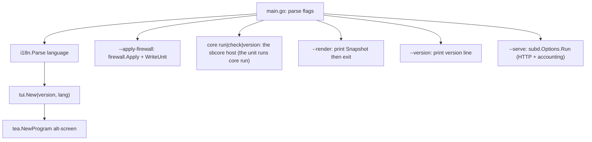

# Architecture

EasySB is one Go module rooted at the repository root. Everything the running
program needs is compiled into a single static binary, **including the sing-box core**:
the module requires `github.com/sagernet/sing-box` and `internal/sbcore` is the host that
runs the node in-process. Nothing is fetched at runtime except acme.sh.

## Repository layout

```
.
├── main.go                         # entry point, flags, version resolution
├── VERSION                         # program version, single source of truth
├── install.sh                      # one-click installer (binary or source)
├── go.mod / go.sum                 # module github.com/MinimaxFlora/EasySB, Go 1.27.1
├── templates/                      # readable JSONC samples and subscription template
│   ├── anytls/
│   ├── hysteria2/
│   ├── tuic/
│   ├── vmess-websocket-tls/
│   ├── vless-vision-reality/
│   └── config/
│       ├── tun-fakeip.json          # TUN + FakeIP sing-box subscription template
│       └── mihomo.yaml              # mihomo / Clash Meta subscription template
├── internal/                       # all implementation packages
├── scripts/                        # helper scripts (release asset pruning, core fetch, VPS checks)
├── assets/                         # README banners
├── docs/                           # these engineering docs
├── AGENTS.md                       # agent entry point
├── README.md                       # English (default)
└── README_ZH.md                    # Chinese
```

`templates/` is documentation and reference material. The subscription templates
actually used at runtime are embedded from `internal/subscribe/tun-fakeip.json`
and `internal/subscribe/mihomo.yaml` via `//go:embed`; keep each pair in sync when
editing.

## Runtime data

| Path | Owner | Purpose |
| :--- | :--- | :--- |
| `/etc/sing-box/easysb.conf` | `internal/state` | persisted node state, legacy-compatible KV |
| `/etc/sing-box/sing-box` | — | no core binary: the node is the panel, started as `easysb core run -c …`. A file left over from an older install is unused |
| `/etc/sing-box/config.json` | `internal/config` | rendered server config |
| `/etc/sing-box/cert/` | `internal/cert` | certificate and key |
| `/etc/sing-box/easysb-users.json` | `internal/user` | accounts: credentials, quotas, expiry and counters (`0600`) |
| `/etc/systemd/system/easysb.service` or `/etc/init.d/easysb` | `internal/service` | subscription service unit (`easysb --serve`) |
| `/etc/systemd/system/sing-box.service` or `/etc/init.d/sing-box` | `internal/service` | core service unit |
| `~/.acme.sh/` | `internal/cert` | acme.sh state; the directory is probed rather than assumed from `$HOME`, and every acme.sh call passes `--home` so writes and reads agree |
| `/etc/sysctl.d/99-easysb-bbr.conf`, `/etc/modules-load.d/easysb-bbr.conf` | `internal/bbr` | BBR settings EasySB writes itself, so they never collide with the kernel project's own drop-in; the sysctl file carries a comment recording the values it replaced, which is what the clear action restores. The installed kernel packages (`minimaxflora-bbrv3`) belong to dpkg and are removed through apt |
| `/etc/sing-box/easysb-ui.conf` | `internal/prefs` | interface choices (skin, palette, marker set, language), `0644`, overridable with `EASYSB_UI_CONF` |
| `/etc/systemd/system/easysb-acme.timer` or `/etc/init.d/easysb-acme` | `internal/cert` | certificate renewal: acme.sh is installed with `--nocron`, so this unit is what renews, and `--renew-certs` reloads the services afterwards. The unit names the path of the binary that wrote it, so it is installed from inside the panel (or with `--install-renew-timer`) rather than copied between hosts |

## Packages

| Package | Responsibility |
| :--- | :--- |
| `internal/tui` | bubbletea model, full-screen dashboard, menu tree, forms, panels, progress |
| `internal/state` | read/write `easysb.conf`; protocol keys, default ports, default parameters |
| `internal/config` | render the sing-box server configuration from state |
| `internal/sbcore` | the sing-box library host: `Version` (module version, injected at build time), `Check` (build an instance and close it = config validation), `Run` (start the node and block), `RealityKeypair`, `StatsAvailable` (build-tag gated). Imports nothing from `internal/`, so `sysinfo` can name the core without a cycle |
| `internal/core` | the core-facing helpers the panel calls: config check, Reality keypair, UUID, `Installed`/`LocalVersion`, `SupportsV2RayStats` — thin wrappers over `internal/sbcore` |
| `internal/cert` | acme.sh discovery, download and install, issue/renew/remove certificates, renewal timer unit, self-signed fallback |
| `internal/prefs` | remember and re-apply the interface choices: skin, palette, marker set, language |
| `internal/firewall` | Hysteria2 port-hopping DNAT rules and the boot restore unit |
| `internal/bbr` | BBR: read the running kernel's congestion control state, enable it through sysctl drop-ins (recording what they replaced so clearing can undo them), and install the prebuilt BBRv3 kernels published by Linux-BBR-v3 (release/tag discovery, mirror fallback, dpkg) |
| `internal/user` | account model and store: per-protocol credentials, quota/expiry evaluation, subscription tokens |
| `internal/subd` | subscription HTTP service: TLS, User-Agent negotiation, response headers, accounting loop |
| `internal/stats` | gRPC client for the core's `StatsService`, usage accounting, quota enforcement |
| `internal/subscribe` | subscription URLs, per-protocol share links, QR payloads, and the sing-box JSON, mihomo YAML and v2rayN base64 documents for one account |
| `internal/secret` | random UUID / password / Reality keypair generation |
| `internal/service` | systemd and OpenRC detection, install, start/stop, status |
| `internal/sysinfo` | host/device/core/service status for the dashboard: local IPv4/IPv6, CPU cores, load, memory, swap, disk and uptime |
| `internal/netutil` | small network helpers (public IPv4-first IP detection, host resolution) |
| `internal/uninstall` | remove the deployment while keeping acme certificates |
| `internal/update` | self-update from the GitHub release tag `v<version>` |
| `internal/i18n` | `C` / `E` bilingual string table |
| `internal/icons` | single-column Unicode symbol palette, `EASYSB_ICONS=ascii` falls back to ASCII |
| `internal/theme` | dark / light color palettes and frame/column layout helpers |

## Program flow



The TUI is a tree of `menu` and `node` values (`internal/tui/menu.go`). Leaves
carry an `actionFunc`; branches carry a `sub *menu`. Actions call the domain
packages and report back through the app's log/progress channel.

## Deploy path

1. `internal/user` loads the accounts and generates the credentials every enabled
   protocol needs.
2. `internal/cert` resolves or issues a certificate.
3. `internal/config` renders `/etc/sing-box/config.json` from the node state, the
   accounts that may be live and the templates.
4. `internal/sbcore` validates the rendered config by building a box from it (no
   subprocess), which is what `easysb core check` does from a shell too.
5. `internal/service` installs and starts the `sing-box.service` unit.
6. The operator installs `easysb.service` from `订阅管理`; `easysb --serve`
   answers subscriptions and accounts traffic.

State is written after each successful step, so a partial deployment can be
resumed.

## Subscription endpoints

`internal/subd` serves one endpoint, `/sub/<token>`, from the built-in service
(`easysb --serve`); `internal/nginx` is gone. The token belongs to one account
and the response format is negotiated from the User-Agent, so a client never has
to choose between three addresses.

| Path | Body | Content type | Client |
| :--- | :--- | :--- | :--- |
| `/sub/<token>` | sing-box JSON profile | `application/json` | sing-box (SFM / SFA / SFI) |
| `/sub/<token>` | mihomo YAML profile | `text/yaml` | mihomo / Clash Meta, luci-app-nikki |
| `/sub/<token>` | Base64 share-link document | `text/plain` | v2rayN, passwall, passwall2, homeproxy |

The Base64 document is the universal format: every client above either reads the
Base64 share links directly or base64-decodes the document first.
`luci-app-nikki` runs the mihomo core and validates the subscription for a
top-level `proxies` key, so it consumes the mihomo profile.
Share links keep the canonical hyphenated UUID because homeproxy rejects the
32-character hyphen-less form through its LuCI `uuid` validation.

The service also reports usage in `Subscription-Userinfo`, so a client can show
"used up" or "expired" without parsing the profile, and refuses an account that
is disabled, expired or over quota with `403` and a plain-text reason instead of
serving a profile with no nodes in it.

`subscribe.ClientLink` builds the QR payload. sing-box wraps the URL in its
deep link (`sing-box://import-remote-profile?url=`) because that is what its
scanner expects. mihomo / Clash Meta and v2rayN get the plain URL: Clash-family
scanners pass the scanned text straight to their HTTP client, so a
`clash://install-config?url=` deep link would fail to fetch.
