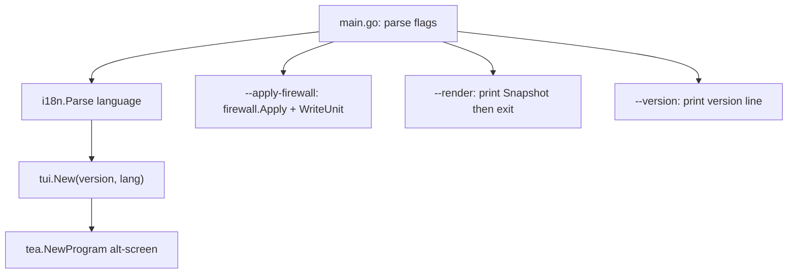

# Architecture

EasySB is one Go module rooted at the repository root. Everything the running
program needs is compiled into a single static binary; nothing is fetched at
runtime except the sing-box core and acme.sh.

## Repository layout

```
.
├── main.go                         # entry point, flags, version resolution
├── VERSION                         # program version, single source of truth
├── install.sh                      # one-click installer (binary or source)
├── go.mod / go.sum                 # module github.com/MinimaxFlora/EasySB, Go 1.27.1
├── templates/                      # readable JSONC samples and subscription template
│   ├── anytls/
│   ├── hysteria2/
│   ├── tuic/
│   ├── vmess-websocket-tls/
│   ├── vless-vision-reality/
│   └── config/tun-fakeip.json      # TUN + FakeIP subscription template
├── internal/                       # all implementation packages
├── assets/                         # README banners
├── docs/                           # these engineering docs
├── AGENTS.md                       # agent entry point
├── README.md                       # English (default)
└── README_ZH.md                    # Chinese
```

`templates/` is documentation and reference material. The subscription template
actually used at runtime is embedded from `internal/subscribe/tun-fakeip.json`
via `//go:embed`; keep the two in sync when editing.

## Runtime data

| Path | Owner | Purpose |
| :--- | :--- | :--- |
| `/etc/sing-box/easysb.conf` | `internal/state` | persisted node state, legacy-compatible KV |
| `/etc/sing-box/sing-box` | `internal/core` | installed core binary |
| `/etc/sing-box/config.json` | `internal/config` | rendered server config |
| `/etc/sing-box/cert/` | `internal/cert` | certificate and key |
| `/etc/sing-box/subscribe/` | `internal/nginx` + `internal/subscribe` | generated subscription files |
| `/etc/systemd/system/sing-box.service` or `/etc/init.d/sing-box` | `internal/service` | core service unit |
| `~/.acme.sh/` | `internal/cert` | acme.sh state |

## Packages

| Package | Responsibility |
| :--- | :--- |
| `internal/tui` | bubbletea model, full-screen dashboard, menu tree, forms, panels, progress |
| `internal/state` | read/write `easysb.conf`; protocol keys, default ports, default parameters |
| `internal/config` | render the sing-box server configuration from state |
| `internal/core` | sing-box release discovery, download (with proxy fallback), install, switch, update |
| `internal/cert` | acme.sh discovery, issue/renew/activate certificates, self-signed fallback |
| `internal/firewall` | Hysteria2 port-hopping DNAT rules and the boot restore unit |
| `internal/nginx` | write the static subscription site and its nginx fragment |
| `internal/subscribe` | subscription URL, per-protocol share links, QR payloads, client template render |
| `internal/secret` | random UUID / password / Reality keypair generation |
| `internal/service` | systemd and OpenRC detection, install, start/stop, status |
| `internal/sysinfo` | host/device/core/service status collected for the dashboard |
| `internal/netutil` | small network helpers (public IP, host resolution) |
| `internal/uninstall` | remove the deployment while keeping acme certificates |
| `internal/update` | self-update from the GitHub release tag `v<version>` |
| `internal/i18n` | `C` / `E` bilingual string table |
| `internal/icons` | Nerd Font icon sets, disabled with `EASYSB_ICONS=0` |
| `internal/theme` | color palette and frame/column layout helpers |

## Program flow



The TUI is a tree of `menu` and `node` values (`internal/tui/menu.go`). Leaves
carry an `actionFunc`; branches carry a `sub *menu`. Actions call the domain
packages and report back through the app's log/progress channel.

## Deploy path

1. `internal/secret` generates credentials.
2. `internal/cert` resolves or issues a certificate.
3. `internal/config` renders `/etc/sing-box/config.json` from state and templates.
4. `internal/core` installs the core if missing.
5. `internal/service` installs and starts the unit.
6. `internal/nginx` + `internal/subscribe` publish the subscription site.

State is written after each successful step, so a partial deployment can be
resumed.
